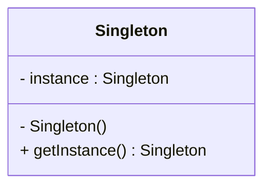

# Introduction aux Design Patterns

## Qu'est-ce qu'un Design Pattern ?

### Définition formelle et informelle

Un **design pattern** (ou patron de conception) est une solution réutilisable à un problème courant dans la conception logicielle. Il s'agit d'un modèle éprouvé qui peut être adapté et appliqué dans différents contextes pour résoudre des problèmes similaires de manière efficace et élégante.

De façon plus formelle, un design pattern est une **solution générale à un problème récurrent dans la conception de logiciels**, qui peut être utilisée pour structurer le code de façon optimale, maintenable et évolutive.

> Selon Wikipedia, un design pattern est "*a general, reusable solution to a commonly occurring problem in many contexts in software design*".  
> [Source - Wikipedia : Software design pattern](https://en.wikipedia.org/wiki/Software_design_pattern)

### Pourquoi utiliser des Design Patterns ?

- **Réutilisabilité** : Ils évitent de réinventer la roue en fournissant des solutions validées.  
- **Communication** : Permettent aux développeurs de mieux communiquer en utilisant un vocabulaire commun.  
- **Maintenance et évolutivité** : Facilite la maintenance du code et son adaptation future.  
- **Qualité de conception** : Encouragent de bonnes pratiques de programmation et une architecture claire.

### Exemple simple : Le Pattern Singleton

Le pattern Singleton garantit qu'une classe ne possède qu'une seule instance et fournit un point d'accès global à cette instance.

**Exemple en pseudo-code :**

```pseudo
class Singleton {
    private static instance = null

    private constructor() {
        // empêcher l'instanciation externe
    }

    public static getInstance() {
        if (instance == null) {
            instance = new Singleton()
        }
        return instance
    }
}
```

Ce pattern est utile lorsqu'une ressource partagée unique est nécessaire, comme une connexion à une base de données ou un gestionnaire de configuration.

### Exemple illustré



Ce diagramme montre que `Singleton` contient une instance privée statique et un constructeur privé, avec une méthode publique pour accéder à l'instance unique.

---

## Résumé

Un design pattern est donc un modèle de solution standard qui s’applique à un problème récurrent dans la conception logicielle. Il facilite la communication entre développeurs, améliore la qualité du code et accélère le développement en fournissant une base éprouvée.

---

## Sources

1. [Wikipedia – Software design pattern](https://en.wikipedia.org/wiki/Software_design_pattern)  
2. [DZone - What Is a Design Pattern?](https://dzone.com/articles/what-is-design-pattern)  
3. [Refactoring.Guru - What’s a design pattern?](https://refactoring.guru/design-patterns/what-is-pattern)