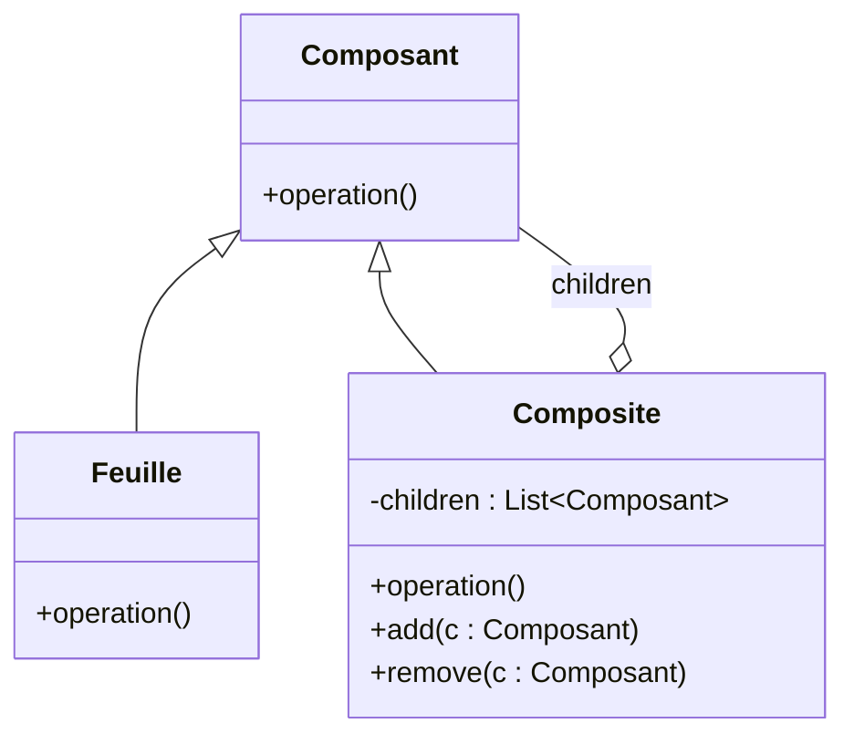

# Introduction aux Design Patterns

## Qu'est-ce qu'un Design Pattern ?

### Les problèmes de conception récurrents que les Design Patterns résolvent

Les design patterns sont nés d’un besoin concret : aider les développeurs à résoudre des problèmes récurrents qui apparaissent fréquemment lors de la conception logicielle. Ces problèmes, si mal gérés, peuvent engendrer un code difficile à maintenir, peu flexible, ou inefficace.

Voici les principaux problèmes de conception que les design patterns traitent :

---

### 1. Gestion des objets et contrôle de leur création

**Problème :** Créer des objets peut devenir complexe, surtout quand ils nécessitent une configuration spécifique, doivent être uniques, ou que leur instanciation a un coût important.

**Exemple de pattern :**  
- **Singleton** : Assure qu’une classe possède une unique instance.  
- **Factory Method** : Définit une interface pour créer un objet, mais laisse les sous-classes décider quelle classe instancier.  
- **Builder** : Utilisé pour construire des objets complexes étape par étape.

**Exemple simple : Factory Method**

```pseudo
interface Product {
    operation()
}

class ConcreteProductA implements Product {
    operation() { print("Produit A") }
}

class Creator {
    abstract factoryMethod() : Product
    
    someOperation() {
        product = factoryMethod()
        product.operation()
    }
}

class ConcreteCreatorA extends Creator {
    factoryMethod() : Product {
        return new ConcreteProductA()
    }
}
```

---

### 2. Organisation et structuration des objets

**Problème :** Organiser les objets en structures complexes peut devenir confus, surtout lorsqu'on veut manipuler des groupes d'objets de manière uniforme.

**Exemple de pattern :**  
- **Composite** : Compose des objets en structures arborescentes pour représenter des hiérarchies partie-tout.  
- **Decorator** : Ajoute dynamiquement des responsabilités à un objet sans modifier son interface.

**Diagramme Mermaid – Composite :**



---

### 3. Communication entre objets

**Problème :** Dans des systèmes complexes, les objets doivent communiquer sans devenir trop dépendants les uns des autres, afin d’éviter un couplage fort qui rend difficile la maintenance et l’évolution.

**Exemple de pattern :**  
- **Observer** : Permet à un objet (le sujet) de notifier automatiquement ses dépendants (les observateurs) lorsqu’il change d’état.  
- **Mediator** : Encapsule la communication entre objets pour éviter qu’ils soient directement liés.

---

### 4. Comportement des objets

**Problème :** Gérer différents comportements ou algorithmes interchangeables sans modifier le code client.

**Exemple de pattern :**  
- **Strategy** : Définit une famille d’algorithmes, encapsule chacun, et les rend interchangeables.  
- **State** : Permet à un objet de modifier son comportement lorsqu’état interne change.

---

### Synthèse par tableau

| Problème                        | Pattern associé                          | Objectif                                             |
|--------------------------------|----------------------------------------|-----------------------------------------------------|
| Gestion de la création          | Singleton, Factory Method, Builder     | Contrôler la manière dont les objets sont créés     |
| Structuration des objets        | Composite, Decorator                    | Organiser les objets en structures flexibles        |
| Communication entre objets      | Observer, Mediator                      | Réduire le couplage entre objets                     |
| Gestion du comportement         | Strategy, State                         | Interchanger des comportements sans modifier le code|

---

## Sources

- [Refactoring.Guru – Design Patterns et problèmes résolus](https://refactoring.guru/design-patterns/what-is-pattern)  
- [Wikipedia – Design Pattern](https://en.wikipedia.org/wiki/Software_design_pattern#Classification)  
- [DZone – Introduction to Design Patterns](https://dzone.com/articles/what-is-design-pattern)  

---

Cet aperçu des problèmes de conception courants met en lumière comment les design patterns offrent des solutions éprouvées, optimisant ainsi la qualité et la maintenabilité du logiciel.