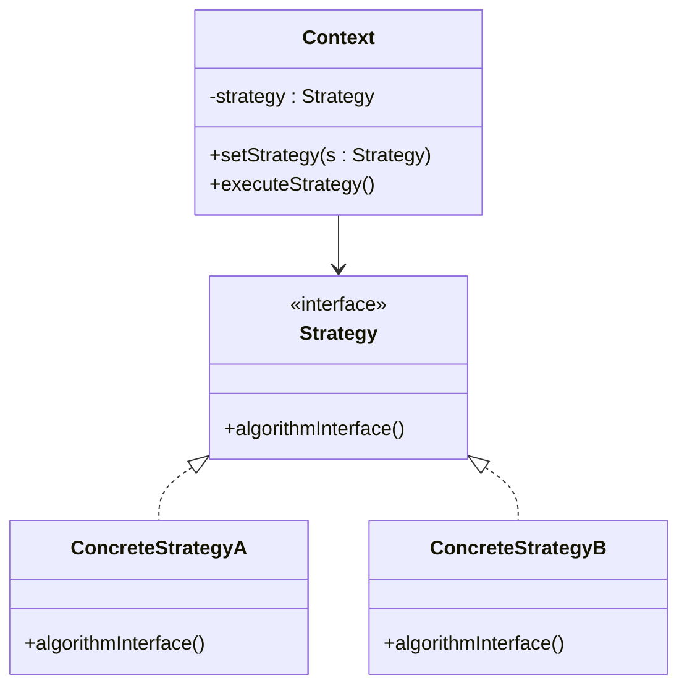

# Introduction aux Design Patterns

## Qu'est-ce qu'un Design Pattern ?

### Avantages de l'utilisation des Design Patterns : réutilisabilité, maintenabilité, flexibilité, communication

L’adoption des design patterns apporte plusieurs avantages essentiels à la qualité et à la robustesse du développement logiciel. Ils améliorent la manière dont le code est conçu, écrit et maintenu, en facilitant la collaboration et l’évolution des applications.

---

### 1. Réutilisabilité

Les design patterns fournissent des solutions génériques, testées et éprouvées, qui peuvent être adaptées à différents projets et contextes. Cela évite de repartir de zéro pour chaque problème récurrent.

**Exemple :** Le pattern **Factory Method** permet de centraliser la création d'objets grâce à une interface commune, ce qui rend le code plus réutilisable et extensible sans modifier les classes clientes.

---

### 2. Maintenabilité

En standardisant les solutions, les design patterns rendent le code plus lisible et bien structuré. Ils aident à découpler les composants, ce qui facilite la correction des bugs et l'ajout de nouvelles fonctionnalités sans risque de provoquer des effets de bord.

**Exemple :** Le pattern **Observer** permet de gérer proprement la communication entre objets en évitant un couplage serré, ce qui simplifie la modification ou la suppression d’observateurs sans impacter les autres parties du système.

---

### 3. Flexibilité

Les design patterns favorisent des architectures modulaires où il est facile de remplacer ou modifier des éléments sans changer l’ensemble du programme. Ils encouragent la programmation orientée interface plutôt que sur des implémentations concrètes.

**Exemple :** Le pattern **Strategy** encapsule des algorithmes interchangeables, permettant de changer le comportement d’un objet à la volée.

---

### 4. Communication améliorée

Utiliser un vocabulaire commun issu des design patterns facilite la communication entre développeurs, architectes et autres parties prenantes du projet. Reconnaître et nommer un pattern dans le code permet de comprendre rapidement sa structure et son comportement.

**Exemple :** Dire qu’un système utilise le pattern **Decorator** indique immédiatement que des fonctionnalités peuvent être ajoutées dynamiquement sans modifier les classes existantes.

---

### Synthèse

| Avantage       | Description                                            | Exemple de Pattern        |
|----------------|--------------------------------------------------------|--------------------------|
| Réutilisabilité | Solutions génériques adaptables à plusieurs contextes | Factory Method, Singleton |
| Maintenabilité | Code lisible, découplé, facile à modifier             | Observer, Command         |
| Flexibilité    | Architecture modulaire, comportements interchangeables| Strategy, State           |
| Communication  | Vocabulaire commun, facilitation de la compréhension  | Decorator, Composite      |

---

## Sources

- [Refactoring.Guru – Advantages of Design Patterns](https://refactoring.guru/design-patterns/advantages)  
- [Wikipedia - Software design pattern](https://en.wikipedia.org/wiki/Software_design_pattern#Advantages)  
- [DZone – Benefits of Using Design Patterns](https://dzone.com/articles/benefits-of-using-design-patterns)  

---

Ce tour d’horizon met en lumière l’impact direct des design patterns sur la qualité du code, son maintien dans le temps, et la collaboration entre équipes, renforçant ainsi la robustesse et la souplesse des applications développées.