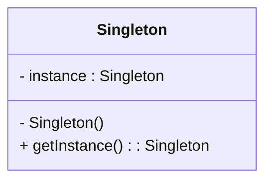

# Historique et Classification des Design Patterns

## Présentation du "Gang of Four" (GoF) et de leur ouvrage fondateur

L’histoire des design patterns en génie logiciel est indissociablement liée à un groupe de quatre auteurs, souvent appelés le **Gang of Four (GoF)**. Ces quatre informaticiens ont révolutionné la façon de penser l’architecture logicielle moderne en formalisant un catalogue de solutions de conception réutilisables et bien définies.

### Qui sont-ils ?

Le **Gang of Four** est composé de :  
- Erich Gamma  
- Richard Helm  
- Ralph Johnson  
- John Vlissides

Ils ont collaboré pour écrire un ouvrage clé :  
**"Design Patterns: Elements of Reusable Object-Oriented Software"** publié en 1994 aux éditions Addison-Wesley.

---

### Contribution majeure

Ce livre est la première référence exhaustive qui recense, décrit et explique 23 design patterns utilisés couramment pour résoudre des problèmes récurrents dans la programmation orientée objet.

L'ouvrage a apporté :  
- Une terminologie commune pour décrire des structures et comportements récurrents,  
- Une classification claire selon leur domaine d’action (création, structure, comportement),  
- Des exemples détaillés dans le langage C++ et Smalltalk,  
- Une méthodologie pour appliquer efficacement ces patterns.

---

### Classification des 23 GoF Design Patterns

Le GoF a regroupé ces patterns en trois catégories principales :

| Catégorie        | Description                                  | Exemples                         |
|------------------|----------------------------------------------|---------------------------------|
| **Création**     | Gestion de la création d’objets              | Singleton, Factory Method, Builder, Prototype, Abstract Factory  |
| **Structure**    | Organisation des classes et objets           | Adapter, Composite, Decorator, Facade, Flyweight, Proxy           |
| **Comportement** | Interaction et responsabilités entre objets | Observer, Strategy, Command, State, Iterator, Mediator, Visitor, Template Method |

---

### Exemple : Pattern Singleton extrait du livre GoF

Forme classique pour restreindre l'instanciation d'une classe à une seule instance.

Dans l'ouvrage, le Singleton est présenté avec des variantes permettant la création sûre dans des contextes multithread.

---

### Impact durable

Le livre du GoF a démocratisé les design patterns, influençant :

- Le développement de nombreux frameworks et bibliothèques,  
- Les pratiques architecturales dans les langages orientés objet modernes (Java, C#, Python, etc.),  
- La pédagogie informatique, où la connaissance des patterns est devenue un socle fondamental.

---

### Sources

- Gamma, Erich, et al. *Design Patterns: Elements of Reusable Object-Oriented Software*, Addison-Wesley, 1994.  
- [Wikipedia – Design pattern](https://en.wikipedia.org/wiki/Software_design_pattern#Gang_of_Four_patterns)  
- [Refactoring.Guru – GoF Design Patterns](https://refactoring.guru/design-patterns/gang-of-four)  

---

L’apport du Gang of Four réside autant dans la formalisation que dans la diffusion d’un savoir-faire structurant la conception logicielle. Leur ouvrage reste une référence majeure pour comprendre et appliquer les design patterns au quotidien.