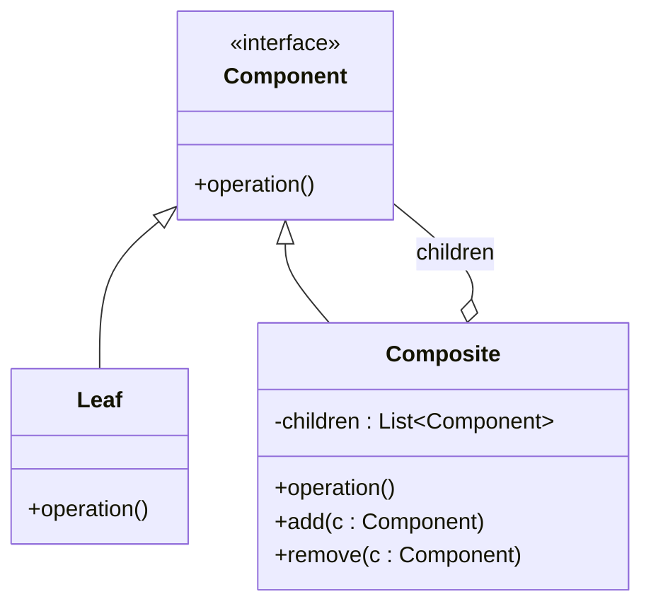

# Historique et Classification des Design Patterns

## Les trois catégories principales de Design Patterns : Création, Structure, Comportement

Les **design patterns**, popularisés par le Gang of Four (GoF), sont classés en trois catégories majeures qui regroupent les solutions selon le type de problème qu’elles visent à résoudre dans la conception orientée objet.

---

## 1. Design Patterns de Création

### Objectif

Gérer la création d’objets d’une manière flexible et adaptée au contexte, permettant d’encapsuler la logique d'instanciation et de réduire le couplage entre classes.

### Exemples principaux

- **Singleton** : Garantit une unique instance d’une classe.  
- **Factory Method** : Définit une interface pour créer un objet, en déléguant l’instanciation aux sous-classes.  
- **Abstract Factory** : Crée des familles d’objets liés sans spécifier leurs classes concrètes.  
- **Builder** : Sépare la construction d’un objet complexe de sa représentation.  
- **Prototype** : Initialise de nouveaux objets en copiant un prototype existant.

---

## 2. Design Patterns Structurels

### Objectif

Définir comment composer et organiser les classes et objets en structures plus grandes et plus flexibles, afin de faciliter leur manipulation et leur extension.

### Exemples principaux

- **Adapter** : Permet à des classes incompatibles de coopérer en convertissant l’interface d’une classe en une autre interface attendue.  
- **Composite** : Compose des objets en structures arborescentes pour traiter uniformément les objets simples et les compositions.  
- **Decorator** : Ajoute dynamiquement des responsabilités à un objet sans modifier sa structure.  
- **Facade** : Fournit une interface unifiée, simplifiée, à un ensemble de classes complexes.  
- **Proxy** : Interpose un substitut pour contrôler l’accès à un autre objet.

---

### Exemple — Composite

Ce diagramme illustre que `Composite` et `Leaf` implémentent l’interface `Component`, permettant de traiter de manière uniforme une structure composée ou une feuille.

---

## 3. Design Patterns Comportementaux

### Objectif

Gérer les interactions entre objets et la distribution des responsabilités, souvent en facilitant la communication ou en modifiant dynamiquement les comportements.

### Exemples principaux

- **Observer** : Définit une dépendance un-à-plusieurs entre objets afin que lorsque l’un change d’état, tous ses dépendants soient notifiés automatiquement.  
- **Strategy** : Définit une famille d’algorithmes interchangeables que l’on peut sélectionner au moment de l’exécution.  
- **Command** : Encapsule une requête sous forme d’objet, permettant de paramétrer les clients avec des actions à exécuter.  
- **State** : Permet à un objet de changer son comportement lorsque son état interne change.  
- **Template Method** : Définit le squelette d’un algorithme en déléguant certaines étapes aux sous-classes.

---

## Synthèse dans un tableau

| Catégorie    | Objectif principal                               | Exemples clés                         |
|--------------|-------------------------------------------------|-------------------------------------|
| Création     | Contrôler la création des objets                 | Singleton, Factory Method, Builder   |
| Structure    | Organiser les classes et objets en structures   | Adapter, Composite, Decorator        |
| Comportement | Gérer les interactions et responsabilités       | Observer, Strategy, Command           |

---

## Sources

- [Refactoring.Guru – Design Patterns Classification](https://refactoring.guru/design-patterns/overview)  
- [Wikipedia – Software design pattern](https://en.wikipedia.org/wiki/Software_design_pattern#Classification)  
- Gamma, E., Helm, R., Johnson, R., Vlissides, J. *Design Patterns: Elements of Reusable Object-Oriented Software*, Addison-Wesley, 1994.  

---

Comprendre cette classification principale permet d’aborder les design patterns avec une vision claire de leur objectif, facilitant ainsi leur sélection et leur application appropriée dans la construction de systèmes logiciels robustes et maintenables.