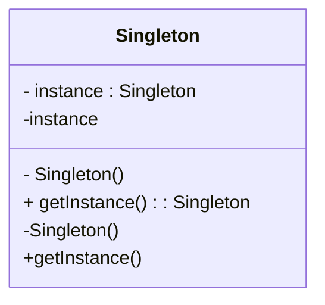

# Design Patterns de Création (Partie 1)

## Singleton : définition et intention

### Qu'est-ce que le pattern Singleton ?

Le **pattern Singleton** est un design pattern de création dont l'objectif est de garantir qu'une classe ne possède qu'une seule instance, et de fournir un point d'accès global à cette instance. Cette approche est utile pour gérer des ressources uniques partagées, comme une connexion à une base de données, un gestionnaire de configuration, ou un logger.

Le défi que résout le Singleton est d'assurer que :
- Une instance unique est créée et contrôlée,
- Cette instance est accessible globalement,
- La création multiple accidentelle est empêchée.

---

### Intention du pattern Singleton

Le pattern vise à **contrôler strictement la création des objets** d'une classe, ce qui peut être particulièrement important quand une seule instance suffit, voire est nécessaire, pour assurer la cohérence d’un état ou d’un service dans une application.

---

### Implémentation typique

La mise en œuvre classique consiste à rendre le constructeur de la classe **privé**, ce qui empêche la création directe de l'objet à l’extérieur, et à fournir une méthode statique (souvent nommée `getInstance()`) qui contrôle l'accès à l'unique instance.

**Exemple en pseudo-code :**

```pseudo
class Singleton {
    private static instance : Singleton = null

    // Constructeur privé pour empêcher l'instanciation extérieure
    private constructor() {}

    public static getInstance() : Singleton {
        if (instance == null) {
            instance = new Singleton()
        }
        return instance
    }
}
```

---

### Diagramme UML Mermaid illustrant le Singleton



- `instance` est un attribut statique privé qui stocke la seule instance de la classe.
- Le constructeur `Singleton()` est privé pour empêcher l'instanciation externe.
- `getInstance()` est une méthode publique statique qui contrôle la création et l’accès à l’instance unique.

---

### Utilisations courantes

- **Gestionnaires de configuration** : Un objet centralisé pour les paramètres du programme.  
- **Logger** : Un unique journal d’événements accessible partout dans l’application.  
- **Connexion à une base de données** : Gérer une connexion unique pour éviter le surcoût de multiples connexions simultanées.  

---

### Limites et variantes

- **Problèmes en environnement multithread** : La mise en œuvre naïve peut poser des problèmes de création concurrente multiple. On utilise alors des mécanismes de synchronisation (verrous, double-check locking).  
- **Testabilité** : Les Singletons peuvent compliquer les tests unitaires à cause de leur état global.  
- **Alternatives** : Injection de dépendances ou conteneurs d’objets pour gérer un cycle de vie à portée plus fine.

---

### Sources

- [Refactoring.Guru – Singleton Pattern](https://refactoring.guru/design-patterns/singleton)  
- [Wikipedia – Singleton pattern](https://en.wikipedia.org/wiki/Singleton_pattern)  
- Gamma, E., Helm, R., Johnson, R., Vlissides, J. *Design Patterns: Elements of Reusable Object-Oriented Software*, Addison-Wesley, 1994.  

---

Le pattern Singleton est un outil simple mais puissant, offrant un moyen fiable de contrôler la création d’instances dans une application. Son application judicieuse évite la prolifération d’objets uniques et garantit une cohérence globale dans les systèmes où cette unicité est cruciale.