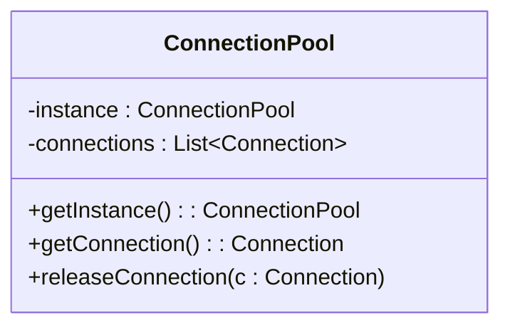

# Design Patterns de Création (Partie 1)  
## Singleton : Cas d’usage typiques et limites

Le pattern Singleton assure la création d’une seule instance d’une classe, accessible globalement. Son utilisation est particulièrement adaptée dans certains scénarios précis mais présente également des inconvénients qu’il convient de connaître.

---

## Cas d’usage typiques

### 1. Gestionnaire de configuration

Dans une application, les paramètres de configuration (fichiers, variables d’environnement, options) doivent généralement être chargés une seule fois et utilisés partout. Le Singleton permet de centraliser cette gestion.

**Exemple en Java :**

```java
public class ConfigManager {
    private static ConfigManager instance;
    private Properties properties;

    private ConfigManager() {
        // Chargement des propriétés
        properties = new Properties();
        // code pour charger le fichier de configuration...
    }

    public static ConfigManager getInstance() {
        if (instance == null) {
            instance = new ConfigManager();
        }
        return instance;
    }
    
    public String getProperty(String key) {
        return properties.getProperty(key);
    }
}
```

---

### 2. Pool de connexions (Connection Pool)

Le pattern est souvent utilisé pour gérer un pool limité de ressources uniques ou coûteuses, comme des connexions à une base de données. Contrôler la création et la gestion de ce pool garantit un accès ordonné et performant.

**Schéma simplifié du rôle du Singleton :**



- La classe `ConnectionPool` est Singleton, garantissant une unique instance gérant toutes les connexions.  
- Accès contrôlé aux connexions pour éviter les conflits et la surcharge.

---

## Limites du pattern Singleton

### 1. Problèmes en contexte multithread

Sans implémentation soigneuse (ex : double-checked locking), de multiples threads peuvent créer plusieurs instances par un accès simultané.

### 2. Difficulté de testabilité

Le Singleton introduit une **dépendance globale** qui complique le testing unitaire, car il empêche d’injecter facilement des mocks ou alternatives.

### 3. Risque de mauvais usage : Couplage fort

Avec un accès global, les objets peuvent dépendre directement du Singleton, ce qui diminue la modularité et accroît le couplage, rendant le code rigide et moins facilement évolutif.

### 4. Cycle de vie rigide

Un Singleton vit généralement tout au long de l'exécution de l’application, ce qui peut poser problème s’il gère des ressources consommant mémoire ou connexions réseaux non libérées.

---

## Alternatives possibles

- Utilisation de **services injectés** via des frameworks d'injection de dépendances (ex : Spring en Java, .NET Core DI) pour mieux contrôler le cycle de vie.  
- Séparation des responsabilités en découplant la gestion d’instance unique de la logique métier.  

---

## Sources

- [Refactoring.Guru – Singleton Pattern Usage and Limitations](https://refactoring.guru/design-patterns/singleton)  
- [Wikipedia – Singleton Pattern](https://en.wikipedia.org/wiki/Singleton_pattern#Usage)  
- [Martin Fowler – Inversion of Control Containers and the Dependency Injection pattern](https://martinfowler.com/articles/injection.html)

---

## Conclusion

Le Singleton répond efficacement à des besoins de ressources uniques partagées globalement, comme les gestionnaires de configuration ou les pools de connexions. Cependant, ses contraintes liées à la concurrence, au testing et à la modularité invitent à en limiter l’usage et à privilégier, lorsque c’est possible, des solutions plus flexibles et testables.