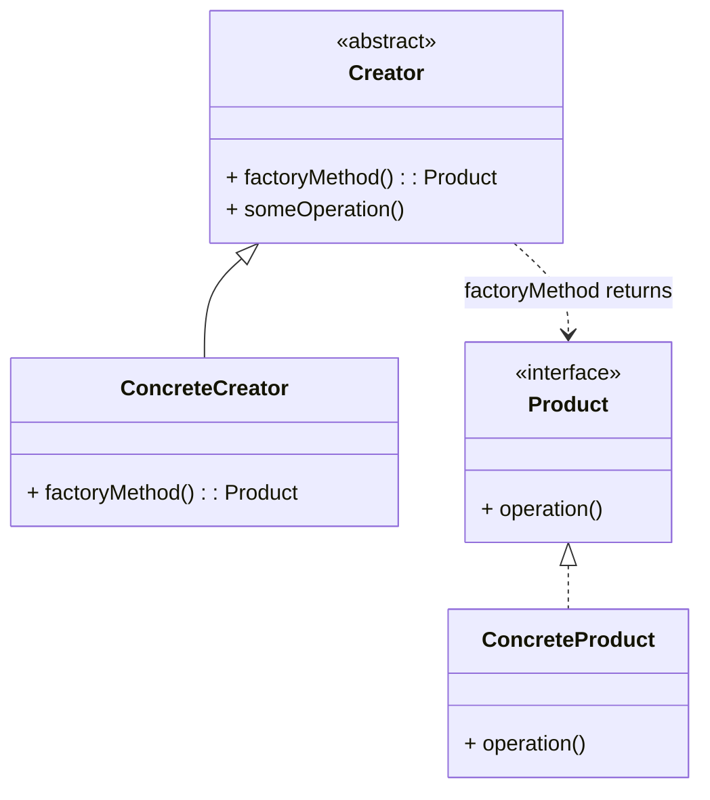

# Design Patterns de Création (Partie 1)  
## Factory Method : définition et intention

Le **Factory Method** est un pattern de création qui propose d’**encapsuler la création d’objets** dans une interface, tout en déléguant aux sous-classes la responsabilité de déterminer quelle classe concrète instancier. Cela permet de rendre le code plus flexible et ouvert à l’extension.

---

## Définition et intention

Le pattern Factory Method définit une interface pour créer un objet, mais laisse ses sous-classes décider de la classe concrète à instancier. Ainsi, le code client peut utiliser le produit via cette interface sans connaître la classe exacte produite.

### Pourquoi utiliser le Factory Method ?

- Détacher la création des objets de leur utilisation.  
- Faciliter l’introduction de nouveaux types de produits sans modifier le code client.  
- Suivre le principe **Ouvert/Fermé** (Open/Closed Principle) : le code est ouvert à l’extension, fermé à la modification.  
- Gérer des familles d’objets liés sans connaître leurs classes concrètes.

---

## Structure générale



- **Creator** déclare la méthode `factoryMethod()` qui retourne un objet de type `Product`.  
- **ConcreteCreator** implémente `factoryMethod()` pour créer une instance spécifique (`ConcreteProduct`).  
- Le client utilise `Creator` et ses méthodes, manipulant ainsi des objets via l’interface `Product`.

---

## Exemple concret en Java

Supposons un système de gestion de documents pouvant créer différents types de documents (texte, PDF).

```java
// Produit
public interface Document {
    void open();
}

// Produit concret 1
public class TextDocument implements Document {
    public void open() {
        System.out.println("Ouverture document texte");
    }
}

// Produit concret 2
public class PdfDocument implements Document {
    public void open() {
        System.out.println("Ouverture document PDF");
    }
}

// Créateur abstrait
public abstract class Application {
    public abstract Document createDocument();

    public void newDocument() {
        Document doc = createDocument();
        doc.open();
    }
}

// Créateurs concrets
public class TextApplication extends Application {
    public Document createDocument() {
        return new TextDocument();
    }
}

public class PdfApplication extends Application {
    public Document createDocument() {
        return new PdfDocument();
    }
}
```

Le client peut ainsi utiliser une application spécifique qui décide du type de document créé.

---

## Fonctionnement

- Le code client utilise la classe abstraite `Application` et sa méthode `newDocument()`.  
- Lorsqu’il crée un document, l’implémentation spécifique dans la sous-classe (ex. `TextApplication`) est utilisée pour choisir la classe concrète du produit.  
- Le client interagit avec l'objet via l'interface `Document`, ignorant la classe concrète.

---

## Sources

- [Refactoring.Guru – Factory Method](https://refactoring.guru/design-patterns/factory-method)  
- [Wikipedia – Factory Method pattern](https://en.wikipedia.org/wiki/Factory_method_pattern)  
- Gamma E., Helm R., Johnson R., Vlissides J., *Design Patterns: Elements of Reusable Object-Oriented Software*, Addison-Wesley, 1994.  

---

Le Factory Method apporte une abstraction dans le processus de création, ce qui accroît la flexibilité et la maintenabilité des applications, en particulier lorsque la famille de produits est susceptible d’évoluer.