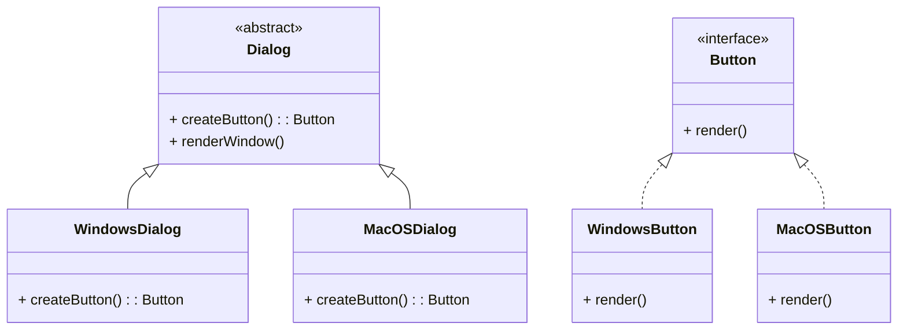

# Design Patterns de Création (Partie 1)  
## Factory Method : Implémentation et diagrammes UML

Le **Factory Method** est un pattern qui définit une méthode pour créer des objets, tout en laissant les classes dérivées décider concrètement quelle classe instancier. Cette séparation favorise la flexibilité et l’extensibilité.

---

## Implémentation classique

### Structure clé

- `Creator` (classe abstraite ou interface) déclare la méthode factory (`factoryMethod`), retournant un `Product`.  
- Les sous-classes `ConcreteCreator` implémentent `factoryMethod()` pour créer des objets spécifiques (`ConcreteProduct`).  
- Le client utilise `Creator` et interagit avec les objets via l’interface `Product`.

---

### Exemple en Java

Considérons un contexte où on crée différents types de boutons UI.

```java
// Produit
public interface Button {
    void render();
}

// Produit concret 1
public class WindowsButton implements Button {
    public void render() {
        System.out.println("Render bouton Windows");
    }
}

// Produit concret 2
public class MacOSButton implements Button {
    public void render() {
        System.out.println("Render bouton MacOS");
    }
}

// Créateur abstrait
public abstract class Dialog {
    public void renderWindow() {
        Button okButton = createButton();
        okButton.render();
    }

    public abstract Button createButton();
}

// Créateurs concrets
public class WindowsDialog extends Dialog {
    public Button createButton() {
        return new WindowsButton();
    }
}

public class MacOSDialog extends Dialog {
    public Button createButton() {
        return new MacOSButton();
    }
}
```

Le client utilise un type de `Dialog` selon le système d’exploitation et le reste de l’application interagit simplement via l’interface `Button`.

---

## Diagramme UML – Structure du Factory Method (Mermaid)



- `Dialog` déclare la méthode abstraite `createButton()`.  
- `WindowsDialog` et `MacOSDialog` produisent respectivement `WindowsButton` et `MacOSButton`.  
- Le client peut invoquer `renderWindow()`, qui utilise le bouton créé par la factory.

---

## Points clés de l’implémentation

- La méthode `factoryMethod()` est généralement abstraite dans le créateur, forçant les sous-classes à fournir leur propre implémentation.  
- Cette implémentation différée permet d’ajouter de nouveaux types de produits sans modifier le code client ni la classe créatrice abstraite.  
- Le client est découplé de la logique d'instanciation concrète.

---

## Sources

- [Refactoring.Guru – Factory Method Pattern](https://refactoring.guru/design-patterns/factory-method)  
- [Wikipedia – Factory Method pattern](https://en.wikipedia.org/wiki/Factory_method_pattern)  
- Gamma E., Helm R., Johnson R., Vlissides J., *Design Patterns: Elements of Reusable Object-Oriented Software*, Addison-Wesley, 1994.  

---

La force majeure du Factory Method réside dans sa capacité à isoler la création d’objets spécifiques dans des classes dédiées, favorisant une architecture plus modulaire et facilitant l’extension future des familles de produits.