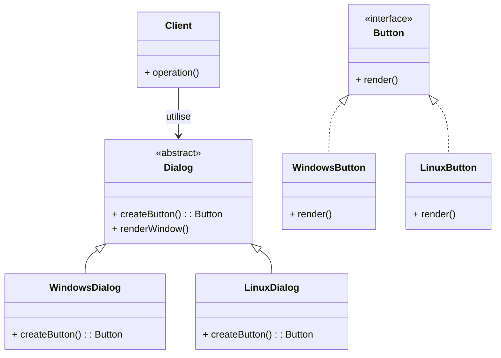

# Design Patterns de Création (Partie 1)  
## Factory Method : Avantages principaux

Le pattern **Factory Method** offre deux avantages fondamentaux qui améliorent la qualité du code :  
- **Découplage** entre le client et la création d'objets.  
- **Extensibilité** facilitée, permettant d’ajouter de nouveaux types sans modifier le client.

---

## 1. Découplage entre client et création

Dans de nombreux systèmes, le client instancie directement des objets concrets, ce qui crée un fort couplage : toute modification ou extension de la famille d’objets affecte le client.

Le Factory Method enferme cette instanciation dans une méthode abstraite, déléguée aux sous-classes spécialisées. Le client interagit seulement avec des interfaces ou classes abstraites, ignorant comment ou quelle classe est effectivement créée.

### Illustration

Sans Factory Method :

```java
Button button = new WindowsButton();  // Couplage direct
button.render();
```

Avec Factory Method :

```java
Dialog dialog = new WindowsDialog();  
Button button = dialog.createButton();  // Client ne connaît pas la classe concrète
button.render();
```

---

## 2. Extensibilité simplifiée

L’ajout d’un nouveau type d’objet ne nécessite pas de modifier la classe cliente ou la classe abstraite. Il suffit de créer une nouvelle sous-classe du créateur et de surcharger la méthode `factoryMethod()`.

### Exemple d’extension

Ajout d’un `LinuxDialog` avec `LinuxButton` :

```java
public class LinuxButton implements Button {
    public void render() {
        System.out.println("Render bouton Linux");
    }
}

public class LinuxDialog extends Dialog {
    public Button createButton() {
        return new LinuxButton();
    }
}
```

Le client peut maintenant utiliser `LinuxDialog` sans aucun changement dans sa logique.

---

## Diagramme Mermaid illustrant le découplage et l’extensibilité



Cela illustre comment le client dépend uniquement de l’abstraction `Dialog` et `Button`, ce qui garantit un faible couplage.

---

## Autres bénéfices parfois observés

- Favorise le principe **Single Responsibility** en centralisant la création des objets.  
- Rend plus facile la gestion des familles de produits liés.  
- Facilite le test unitaire (mock de sous-classes spécialisées).

---

## Sources

- [Refactoring.Guru – Factory Method Advantages](https://refactoring.guru/design-patterns/factory-method)  
- [Wikipedia – Factory Method](https://en.wikipedia.org/wiki/Factory_method_pattern)  
- Gamma E., Helm R., Johnson R., Vlissides J., *Design Patterns: Elements of Reusable Object-Oriented Software*, Addison-Wesley, 1994.  

---

En résumé, le Factory Method assure un découplage solide entre clients et produits, et soutient l’évolution du code via une architecture ouverte à l’extension. C’est un outil clé pour concevoir des systèmes modulaires et maintenables.