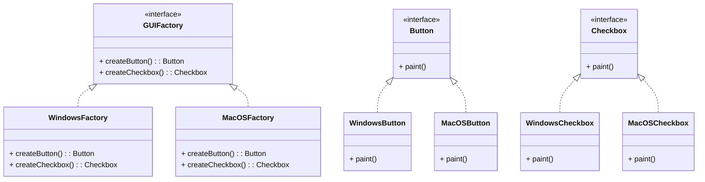

# Design Patterns de Création (Partie 2)  
## Abstract Factory : définition et intention

L’**Abstract Factory** est un pattern de création qui permet de fournir une **interface** pour créer des **familles d’objets apparentés ou interdépendants**, sans spécifier leurs classes concrètes. Ce mécanisme assure la cohérence entre les produits d’une même famille et facilite l’extensibilité.

---

## Définition

L’Abstract Factory propose une interface qui regroupe plusieurs méthodes de fabrication de produits, chaque méthode correspondant à un type d’objet. Elle permet de créer différentes familles complètes de produits sans que le client connaisse les classes concrètes utilisées.

---

## Intention du pattern

- **Encapsuler un ensemble d’objets liés à créer en une seule interface.**  
- **Garantir que les produits d’une même famille soient compatibles.**  
- **Isoler le client des détails spécifiques de l’instanciation.**  
- **Faciliter le changement d’une famille de produits complète simplement en changeant l’usine abstraite utilisée.**

---

## Illustration conceptuelle

Imaginez une application avec deux styles d’interface utilisateur : Windows et MacOS. Ces styles nécessitent des **boutons** et des **cases à cocher** spécifiques, qui doivent fonctionner ensemble visuellement et fonctionnellement.

**L’Abstract Factory fournit :**

- Une interface pour créer un bouton et une case à cocher.  
- Des usines concrètes (`WindowsFactory` et `MacOSFactory`) pour créer les variantes respectives.  

---

## Diagramme de classes Mermaid



---

## Exemple concret en Java

```java
// Interfaces produits
public interface Button {
    void paint();
}

public interface Checkbox {
    void paint();
}

// Produits Windows
public class WindowsButton implements Button {
    public void paint() {
        System.out.println("Rendering Windows button");
    }
}

public class WindowsCheckbox implements Checkbox {
    public void paint() {
        System.out.println("Rendering Windows checkbox");
    }
}

// Produits MacOS
public class MacOSButton implements Button {
    public void paint() {
        System.out.println("Rendering MacOS button");
    }
}

public class MacOSCheckbox implements Checkbox {
    public void paint() {
        System.out.println("Rendering MacOS checkbox");
    }
}

// Usine abstraite
public interface GUIFactory {
    Button createButton();
    Checkbox createCheckbox();
}

// Usines concrètes
public class WindowsFactory implements GUIFactory {
    public Button createButton() {
        return new WindowsButton();
    }
    public Checkbox createCheckbox() {
        return new WindowsCheckbox();
    }
}

public class MacOSFactory implements GUIFactory {
    public Button createButton() {
        return new MacOSButton();
    }
    public Checkbox createCheckbox() {
        return new MacOSCheckbox();
    }
}

// Client
public class Application {
    private Button button;
    private Checkbox checkbox;

    public Application(GUIFactory factory) {
        button = factory.createButton();
        checkbox = factory.createCheckbox();
    }

    public void paint() {
        button.paint();
        checkbox.paint();
    }
}
```

---

## Fonctionnement

Pour changer le style de l’interface, il suffit de remplacer l’implémentation de `GUIFactory` passée au client :

```java
GUIFactory factory;
String osName = System.getProperty("os.name").toLowerCase();

if (osName.contains("windows")) {
    factory = new WindowsFactory();
} else {
    factory = new MacOSFactory();
}

Application app = new Application(factory);
app.paint();
```

Le client n’a aucune connaissance des classes concrètes des produits. Il travaille uniquement avec l’abstraction.

---

## Sources

- [Refactoring.Guru – Abstract Factory](https://refactoring.guru/design-patterns/abstract-factory)  
- [Wikipedia – Abstract Factory pattern](https://en.wikipedia.org/wiki/Abstract_factory_pattern)  
- Gamma E., Helm R., Johnson R., Vlissides J., *Design Patterns: Elements of Reusable Object-Oriented Software*, Addison-Wesley, 1994.  

---

L’Abstract Factory se révèle particulièrement utile lorsque plusieurs types de produits liés doivent être créés ensemble de façon cohérente, tout en maintenant un couplage faible et en facilitant la maintenance et l’évolution.