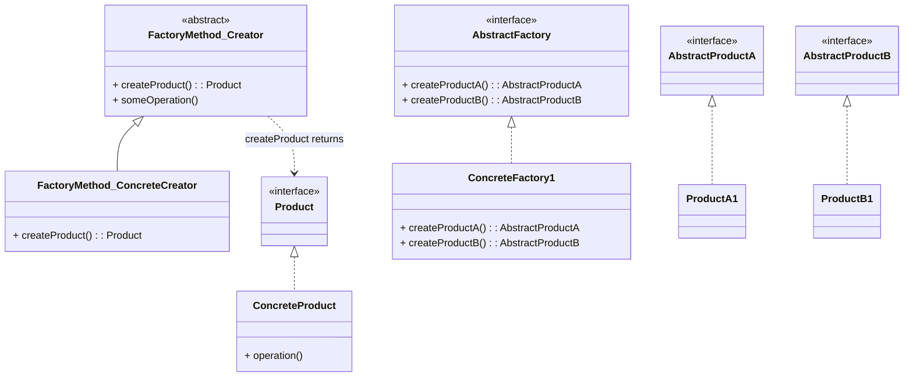

# Design Patterns de Création (Partie 2)  
## Abstract Factory : différence avec Factory Method

Les patterns **Abstract Factory** et **Factory Method** sont deux patrons de création qui facilitent l’instanciation flexible d’objets, mais ils ciblent des problématiques différentes et opèrent à des niveaux distincts.

---

## Différences principales

| Critère                  | Factory Method                                       | Abstract Factory                                               |
|--------------------------|-----------------------------------------------------|----------------------------------------------------------------|
| **Objet créé**           | Un seul type d’objet concret                         | Une famille d’objets apparentés                                |
| **Nombre de méthodes de création** | Une seule méthode abstraite pour créer un produit | Plusieurs méthodes abstraites regroupées dans une interface    |
| **Héritage**             | Utilise l’héritage : sous-classes implémentent la méthode de création | Utilise la composition : une usine concrète instancie plusieurs produits |
| **Complexité**           | Plus simple, pour une seule hiérarchie de produit   | Plus complexe, pour gérer plusieurs variantes de plusieurs produits |
| **But**                  | Déléguer la création d’un objet particulier à une sous-classe | Fournir une interface pour créer des familles cohérentes d’objets |

---

## Explication simplifiée

- Le **Factory Method** définit une interface pour la création d’un seul produit, et la sous-classe décide de la classe concrète.  
- L’**Abstract Factory** définit une interface pour créer plusieurs objets liés (une famille de produits), implémentée par des usines concrètes qui produisent ces produits compatibles.

---

## Exemple comparatif

### Factory Method : création d’un type de produit (bouton)

```java
public abstract class Dialog {
    public abstract Button createButton();
    public void renderWindow() {
        Button okButton = createButton();
        okButton.render();
    }
}

public class WindowsDialog extends Dialog {
    public Button createButton() {
        return new WindowsButton();
    }
}

public class WindowsButton implements Button {
    public void render() {
        System.out.println("Render Windows Button");
    }
}
```

---

### Abstract Factory : création d’une famille de produits (bouton + case à cocher)

```java
public interface GUIFactory {
    Button createButton();
    Checkbox createCheckbox();
}

public class WindowsFactory implements GUIFactory {
    public Button createButton() {
        return new WindowsButton();
    }
    public Checkbox createCheckbox() {
        return new WindowsCheckbox();
    }
}

public interface Button { void paint(); }
public interface Checkbox { void paint(); }

public class WindowsButton implements Button {
    public void paint() {
        System.out.println("Windows Button");
    }
}
public class WindowsCheckbox implements Checkbox {
    public void paint() {
        System.out.println("Windows Checkbox");
    }
}
```

---

## Diagramme comparatif



---

## Résumé

| Aspect | Factory Method | Abstract Factory |
|--------|---------------|------------------|
| Type d’objets créés | Un produit unique | Famille de produits liés |
| Création | Méthode abstraite dans une classe abstraite | Interface avec plusieurs méthodes |
| Flexibilité | Découpage via héritage | Découpage via composition d’usines |
| Utilisation typique | Libérer l’instanciation d’un seul type | Garantir la cohérence entre plusieurs objets | 

---

## Sources

- [Refactoring.Guru – Factory Method vs Abstract Factory](https://refactoring.guru/design-patterns/abstract-factory)  
- [Wikipedia – Factory Method](https://en.wikipedia.org/wiki/Factory_method_pattern)  
- [Wikipedia – Abstract Factory](https://en.wikipedia.org/wiki/Abstract_factory_pattern)  
- Gamma E., Helm R., Johnson R., Vlissides J., *Design Patterns: Elements of Reusable Object-Oriented Software*, Addison-Wesley, 1994.  

---

En somme, le choix entre Factory Method et Abstract Factory dépend du besoin : un produit unique avec instanciation différée, ou une famille complète de produits devant rester cohérente. Comprendre leurs différences permet d’adopter la solution optimale pour chaque contexte.