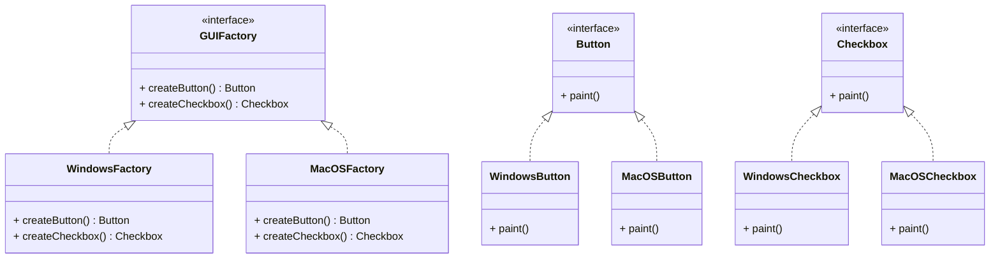

# Design Patterns de Création (Partie 2)  
## Abstract Factory : Implémentation et exemple de familles d’éléments d’interface utilisateur multi-plateformes

Le pattern **Abstract Factory** facilite la création de familles complètes d’objets apparentés sans exposer la logique de création au client. Il est particulièrement utile dans le contexte des interfaces utilisateurs multi-plateformes, où les composants (boutons, cases à cocher, fenêtres, etc.) doivent être cohérents au sein d’une plateforme donnée.

---

## Implémentation typique

### Étapes clés

1. **Définir les interfaces des produits abstraits** : par exemple, `Button`, `Checkbox`.  
2. **Définir une interface `AbstractFactory`** regroupant les méthodes de création (ex. `createButton()`, `createCheckbox()`).  
3. **Implémenter les produits concrets** pour chaque plateforme (ex. `WindowsButton`, `MacOSButton`).  
4. **Implémenter les usines concrètes** (ex. `WindowsFactory`, `MacOSFactory`) qui produisent les objets de la plateforme correspondante.  
5. **Le client utilise l’usine abstraite** pour récupérer les objets, restant indépendant de l’implémentation concrète.

---

## Exemple concret en Java : interface multi-plateforme

### Interfaces produits

```java
public interface Button {
    void paint();
}

public interface Checkbox {
    void paint();
}
```

### Produits Windows

```java
public class WindowsButton implements Button {
    public void paint() {
        System.out.println("Rendering Windows button");
    }
}

public class WindowsCheckbox implements Checkbox {
    public void paint() {
        System.out.println("Rendering Windows checkbox");
    }
}
```

### Produits MacOS

```java
public class MacOSButton implements Button {
    public void paint() {
        System.out.println("Rendering MacOS button");
    }
}

public class MacOSCheckbox implements Checkbox {
    public void paint() {
        System.out.println("Rendering MacOS checkbox");
    }
}
```

### Abstract Factory

```java
public interface GUIFactory {
    Button createButton();
    Checkbox createCheckbox();
}
```

### Usines concrètes

```java
public class WindowsFactory implements GUIFactory {
    public Button createButton() {
        return new WindowsButton();
    }
    public Checkbox createCheckbox() {
        return new WindowsCheckbox();
    }
}

public class MacOSFactory implements GUIFactory {
    public Button createButton() {
        return new MacOSButton();
    }
    public Checkbox createCheckbox() {
        return new MacOSCheckbox();
    }
}
```

### Client

```java
public class Application {
    private Button button;
    private Checkbox checkbox;

    public Application(GUIFactory factory) {
        button = factory.createButton();
        checkbox = factory.createCheckbox();
    }

    public void paint() {
        button.paint();
        checkbox.paint();
    }
}
```

Pour choisir dynamiquement l’usine selon le système :

```java
public class ApplicationConfigurator {
    public static Application configureApplication() {
        GUIFactory factory;
        String osName = System.getProperty("os.name").toLowerCase();
        if (osName.contains("windows")) {
            factory = new WindowsFactory();
        } else {
            factory = new MacOSFactory();
        }
        return new Application(factory);
    }
}
```

---

## Diagramme Mermaid



---

## Avantages illustrés

- **Cohérence des produits** : tous les composants ont le même style (Windows, MacOS), évitant les incompatibilités visuelles ou fonctionnelles.  
- **Facilité de maintenance** : ajouter une nouvelle plateforme revient à ajouter une nouvelle usine et ses produits, sans modifier le client.  
- **Découplage** : le client manipule uniquement des interfaces, ignorant les détails d’implémentation.

---

## Sources

- [Refactoring.Guru - Abstract Factory Pattern](https://refactoring.guru/design-patterns/abstract-factory)  
- [Wikipedia - Abstract Factory Pattern](https://en.wikipedia.org/wiki/Abstract_factory_pattern)  
- Gamma, Helm, Johnson, Vlissides, *Design Patterns*, Addison-Wesley, 1994.

---

L’Abstract Factory facilite la gestion de familles cohérentes d’objets, notamment dans des architectures multi-plateformes où encourager la modularité et la facilité d’extension est essentiel.