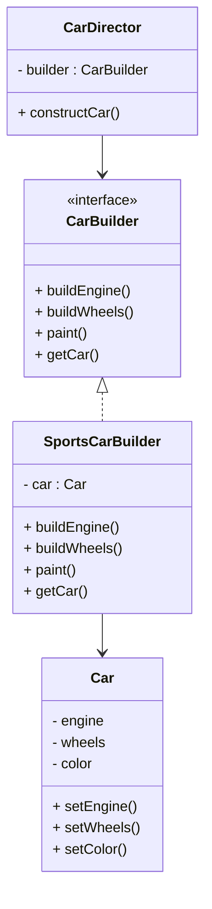

# Design Patterns de Création (Partie 2)  
## Builder : définition et intention

Le pattern **Builder** est destiné à la construction d’objets complexes étape par étape. Il permet de séparer la représentation d’un objet de sa construction, offrant ainsi une grande flexibilité dans le processus d’instanciation.

---

## Définition

Le Builder propose une interface abstraite pour assembler les différentes parties d'un objet complexe. Un **directeur** (optionnel) oriente la construction en invoquant les étapes dans un ordre prédéfini, tandis que le **builder concret** réalise concrètement chaque étape.

---

## Intention

- Construire un objet complexe en plusieurs étapes clairement séparées.  
- Permettre différentes représentations (variantes) du même objet par différents builders.  
- Déléguer la construction au builder, laissant au client la possibilité de récupérer l’objet finalisé.  
- Simplifier la création d’objets immuables ou sans constructeur à nombreux paramètres.

---

## Exemple concret : construction d’une voiture

### Interfaces

```java
// Produit complexe
public class Car {
    private String engine;
    private String wheels;
    private String color;

    public void setEngine(String engine) { this.engine = engine; }
    public void setWheels(String wheels) { this.wheels = wheels; }
    public void setColor(String color) { this.color = color; }

    public String toString() {
        return "Car [engine=" + engine + ", wheels=" + wheels + ", color=" + color + "]";
    }
}

// Builder abstrait
public interface CarBuilder {
    void buildEngine();
    void buildWheels();
    void paint();
    Car getCar();
}

// Builder concret
public class SportsCarBuilder implements CarBuilder {
    private Car car = new Car();

    public void buildEngine() { car.setEngine("V8 Engine"); }
    public void buildWheels() { car.setWheels("18 inch Alloy Wheels"); }
    public void paint() { car.setColor("Red"); }
    public Car getCar() { return car; }
}
```

### Directeur

```java
public class CarDirector {
    private CarBuilder builder;

    public CarDirector(CarBuilder builder){
        this.builder = builder;
    }

    public void constructCar(){
        builder.buildEngine();
        builder.buildWheels();
        builder.paint();
    }
}
```

### Utilisation client

```java
public class Client {
    public static void main(String[] args) {
        CarBuilder builder = new SportsCarBuilder();
        CarDirector director = new CarDirector(builder);
        director.constructCar();
        Car car = builder.getCar();
        System.out.println(car);
    }
}
```

---

## Diagramme Mermaid simplifié



---

## Points clés

- Le Builder découple la construction de l’objet de sa représentation finale.  
- Plusieurs builders peuvent coexister, chacun produisant une variante différente du produit.  
- Le client peut diriger finement la construction ou déléguer l’ordre au directeur.  
- Adapté pour des objets avec paramètres multiples, complexes ou immuables.

---

## Sources

- [Refactoring.Guru – Builder Pattern](https://refactoring.guru/design-patterns/builder)  
- [Wikipedia – Builder Pattern](https://en.wikipedia.org/wiki/Builder_pattern)  
- Gamma E., Helm R., Johnson R., Vlissides J., *Design Patterns: Elements of Reusable Object-Oriented Software*, Addison-Wesley, 1994.

---

Le Builder offre une solution structurée pour construire des objets complexes, évitant les constructeurs surchargés et simplifiant la maintenance et l’extension.