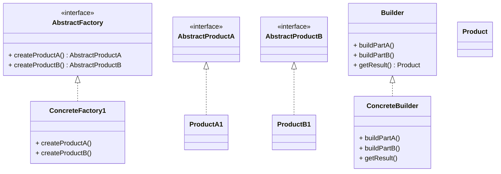

# Design Patterns de Création (Partie 2)  
## Builder vs Abstract Factory : Comparaison et cas d’usage

Les **patterns Builder** et **Abstract Factory** font tous deux partie des design patterns de création, mais ils répondent à des besoins distincts et s’appliquent dans des contextes différents.

---

## Différences fondamentales

| Critère                     | Builder                                           | Abstract Factory                               |
|-----------------------------|--------------------------------------------------|-----------------------------------------------|
| **But principal**            | Construire un objet complexe étape par étape, surtout avec de nombreux paramètres (optionnels ou compliqués) | Créer une famille d’objets liés ou dépendants de manière cohérente |
| **Produit**                 | Un seul objet complexe                            | Plusieurs objets qui forment une famille      |
| **Construction**            | Processus étape par étape, souvent avec méthodes chaînées (Fluent API) | Factory avec différentes méthodes pour chaque type d’objet |
| **Découplage**              | Sépare la logique de construction et la représentation | Fournit une interface d’usine abstraite pour créer des objets liés |
| **Utilisation typique**     | Configurer un objet avec de nombreux paramètres optionnels ou configurables | Générer plusieurs types d’objets compatibles selon une plateforme ou une variante |

---

## Cas d’usage du Builder : objets avec de nombreux paramètres optionnels

Les objets complexes, notamment ceux avec un grand nombre de paramètres optionnels ou variables, posent un problème avec l’utilisation de constructeurs classiques (constructeurs telescopes) : la maintenance, la lisibilité du code et le risque d’erreurs augmentent.

### Exemple : configuration d’un objet `Person` avec le Builder

```java
public class Person {
    private final String firstName;
    private final String lastName;
    private final int age;
    private final String phone;
    private final String address;

    private Person(PersonBuilder builder) {
        this.firstName = builder.firstName;
        this.lastName = builder.lastName;
        this.age = builder.age;
        this.phone = builder.phone;
        this.address = builder.address;
    }

    public static class PersonBuilder {
        private final String firstName;
        private final String lastName;
        private int age;
        private String phone;
        private String address;

        public PersonBuilder(String firstName, String lastName) {
            this.firstName = firstName;
            this.lastName = lastName;
        }

        public PersonBuilder age(int age) {
            this.age = age;
            return this;
        }

        public PersonBuilder phone(String phone) {
            this.phone = phone;
            return this;
        }

        public PersonBuilder address(String address) {
            this.address = address;
            return this;
        }

        public Person build() {
            return new Person(this);
        }
    }

    @Override
    public String toString() {
        return firstName + " " + lastName + ", age: " + age + ", phone: " + phone + ", address: " + address;
    }
}
```

### Utilisation

```java
Person person = new Person.PersonBuilder("John", "Doe")
    .age(30)
    .phone("123456789")
    .address("123 Main St")
    .build();

System.out.println(person);
```

Ce pattern permet d’éviter la prolifération de constructeurs surchargés et améliore la clarté.

---

## Abstract Factory : création de familles cohérentes

Contrairement au Builder, l’Abstract Factory crée un **ensemble complet d’objets liés** (exemple : composants graphiques Windows ou MacOS).

---

## Synthèse : quand utiliser quoi ?

| Besoin / Situation                                          | Utiliser Builder                               | Utiliser Abstract Factory                      |
|------------------------------------------------------------|-----------------------------------------------|------------------------------------------------|
| Construction d’un objet individuel complexe                 | ✔                                            | ✘                                             |
| Nombre élevé de paramètres optionnels                       | ✔                                            | ✘                                             |
| Créer une famille d’objets interconnectés                   | ✘                                             | ✔                                             |
| Garantir la cohérence entre les objets créés                | ✘                                             | ✔                                             |
| Focus sur la représentation du produit final                | ✔                                            | ✘                                             |

---

## Diagramme comparatif



---

## Sources et références

- [Refactoring.Guru – Builder vs Abstract Factory](https://refactoring.guru/design-patterns/builder-vs-factory)  
- [Wikipedia – Builder pattern](https://en.wikipedia.org/wiki/Builder_pattern)  
- [Wikipedia – Abstract Factory pattern](https://en.wikipedia.org/wiki/Abstract_factory_pattern)  
- Gamma E., Helm R., Johnson R., Vlissides J., *Design Patterns: Elements of Reusable Object-Oriented Software*, Addison-Wesley, 1994.

---

## Conclusion

Le choix entre **Builder** et **Abstract Factory** dépend du problème à résoudre. Le Builder est privilégié quand il faut construire un objet complexe et configurable à la volée avec de nombreux paramètres, tandis que l’Abstract Factory est adapté pour générer des familles complètes d’objets compatibles sur différents contextes ou plateformes. Connaître ces différences permet d’appliquer le pattern approprié et d’optimiser la conception de vos logiciels.
