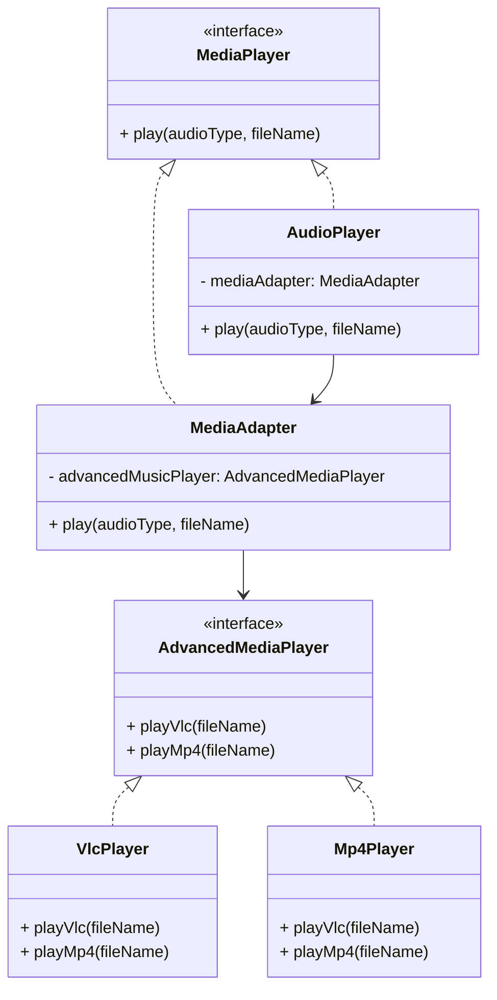

# Design Patterns de Structure (Partie 1)  
## Adapter : définition et intention

Le design pattern **Adapter** permet de faire collaborer des objets dont les interfaces sont incompatibles, en fournissant une interface intermédiaire qui adapte l’usage entre eux.  

Ce pattern s’avère particulièrement utile quand un composant existant doit être réutilisé dans un contexte différent sans modifier son code.

---

## Définition

L’Adapter agit comme un **pont** entre deux interfaces incompatibles. Il convertit l’interface d’une classe (l’adaptée) en une interface attendue par le client, afin que ces deux entités puissent collaborer.

---

## Intention

- Permettre à des classes ayant des interfaces incompatibles de fonctionner ensemble.  
- Réutiliser des classes existantes sans modifier leur code.  
- Simplifier l’intégration de composants tiers aux interfaces différentes.  

---

## Exemple concret : interface incompatible de lecteur audio

Supposons un système qui attend une interface `MediaPlayer` :

```java
public interface MediaPlayer {
    void play(String audioType, String fileName);
}
```

Mais nous disposons d'un lecteur audio avancé qui ne supporte que des fichiers `vlc` ou `mp4` via une interface incompatible :

```java
public interface AdvancedMediaPlayer {
    void playVlc(String fileName);
    void playMp4(String fileName);
}

public class VlcPlayer implements AdvancedMediaPlayer {
    public void playVlc(String fileName) {
        System.out.println("Playing vlc file: " + fileName);
    }
    public void playMp4(String fileName) { }
}

public class Mp4Player implements AdvancedMediaPlayer {
    public void playVlc(String fileName) { }
    public void playMp4(String fileName) {
        System.out.println("Playing mp4 file: " + fileName);
    }
}
```

### Adapter

```java
public class MediaAdapter implements MediaPlayer {
    AdvancedMediaPlayer advancedMusicPlayer;

    public MediaAdapter(String audioType){
        if(audioType.equalsIgnoreCase("vlc")){
            advancedMusicPlayer = new VlcPlayer();
        } else if(audioType.equalsIgnoreCase("mp4")){
            advancedMusicPlayer = new Mp4Player();
        }    
    }

    public void play(String audioType, String fileName) {
        if(audioType.equalsIgnoreCase("vlc")){
            advancedMusicPlayer.playVlc(fileName);
        } else if(audioType.equalsIgnoreCase("mp4")){
            advancedMusicPlayer.playMp4(fileName);
        }
    }
}
```

### Client

```java
public class AudioPlayer implements MediaPlayer {
    MediaAdapter mediaAdapter;

    public void play(String audioType, String fileName) {
        if(audioType.equalsIgnoreCase("mp3")){
            System.out.println("Playing mp3 file: " + fileName);
        } else if(audioType.equalsIgnoreCase("vlc") || audioType.equalsIgnoreCase("mp4")){
            mediaAdapter = new MediaAdapter(audioType);
            mediaAdapter.play(audioType, fileName);
        } else {
            System.out.println("Invalid media. " + audioType + " format not supported");
        }
    }
}
```

---

## Diagramme



---

## Synthèse

| Aspect                      | Adapter                       |
|-----------------------------|------------------------------|
| Objectif                    | Adapter une interface existante à celle attendue |
| Utilisation typique          | Intégration de classes tierces ou légacies        |
| Complexité                  | Faible à moyenne             |
| Modèle relationnel          | Composition                  |
| Type de pattern            | Structurel                  |

---

## Sources

- [Refactoring.Guru – Adapter Pattern](https://refactoring.guru/design-patterns/adapter)  
- [Wikipedia – Adapter Pattern](https://en.wikipedia.org/wiki/Adapter_pattern)  
- Gamma E., Helm R., Johnson R., Vlissides J., *Design Patterns: Elements of Reusable Object-Oriented Software*, Addison-Wesley, 1994.

---

L’Adapter facilite la réutilisation dans des systèmes hétérogènes en comblant le fossé entre interfaces différentes, sans modifier les classes existantes ni compromettre la modularité.