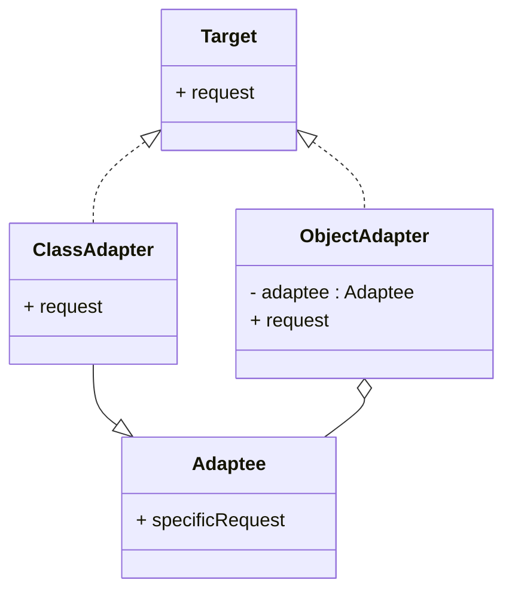

# Design Patterns de Structure (Partie 1)  
## Adapter : Types d’adaptateurs - Classe et Objet

Le pattern **Adapter** permet à des interfaces incompatibles de collaborer en adaptant l’un des objets à l’interface attendue. Il existe deux principales implémentations de ce pattern : **l’Adapter par classe** et **l’Adapter par objet**. Chacune possède ses avantages et contraintes, selon le langage utilisé et le contexte applicatif.

---

## 1. Adapter par Classe (Class Adapter)

### Principe

L’adaptateur hérite à la fois de l’interface cible attendue et de la classe adaptée. Il réalise l’adaptation en héritant des fonctionnalités et en les redéfinissant selon l’interface requise.

### Caractéristiques

- Utilise l’héritage multiple (ou interfaces combinées) pour combiner l’interface source et l’interface cible.  
- Permet de substituer une interface de classe directement à une autre.  
- Limité aux langages supportant l’héritage multiple (ex : C++).  
- Plus couplé à la classe adaptée, donc moins flexible si la classe de base change.

### Exemple (en Java, via interface et héritage simple)

Imaginons une interface cible `Target` et une classe adaptee `Adaptee`:

```java
interface Target {
    void request();
}

class Adaptee {
    void specificRequest() {
        System.out.println("Appel spécifique dans Adaptee");
    }
}

class ClassAdapter extends Adaptee implements Target {
    public void request() {
        specificRequest();  // adaptation via héritage
    }
}
```

---

## 2. Adapter par Objet (Object Adapter)

### Principe

L’adaptateur contient une instance de la classe adaptée (composition) et redirige les appels vers cette instance en adaptant les interfaces.

### Caractéristiques

- Repose sur la **composition** au lieu de l’héritage.  
- Plus souple car il peut adapter des objets à runtime.  
- Supporté dans tous les langages orientés objets.  
- Découplage plus fort entre l’adaptateur et la classe adaptée.

### Exemple

```java
interface Target {
    void request();
}

class Adaptee {
    void specificRequest() {
        System.out.println("Appel spécifique dans Adaptee");
    }
}

class ObjectAdapter implements Target {
    private Adaptee adaptee;

    public ObjectAdapter(Adaptee adaptee){
        this.adaptee = adaptee;
    }

    public void request() {
        adaptee.specificRequest();  // délégation
    }
}
```

---

## Comparaison synthétique

| Critère               | Adapter par Classe                           | Adapter par Objet                  |
|-----------------------|---------------------------------------------|----------------------------------|
| Mécanisme             | Héritage multiple                           | Composition                      |
| Flexibilité           | Faible (fort couplage statique)             | Élevée (objet adaptable à runtime) |
| Langage requis        | Langage supportant héritage multiple (C++) | Tous langages orientés objet     |
| Réutilisation         | Réutilisation limitée sur classes non modifiables | Adaptation dynamique possible     |
| Complexité            | Simple si héritage possible                  | Léger surcoût d’abstraction      |

---

## Diagramme illustratif



---

## Conclusion

- **Adapter par classe** est simple et efficace lorsque le langage supporte l’héritage multiple et que la classe adaptée peut être directement héritée.  
- **Adapter par objet** offre plus de souplesse, favorise le découplage, et permet l’adaptation dynamique d’instances.  

La majorité des implémentations modernes privilégient l’**Adapter par objet** pour sa flexibilité et compatibilité.

---

## Sources

- [Refactoring.Guru – Adapter Pattern](https://refactoring.guru/design-patterns/adapter)  
- [Wikipedia – Adapter pattern](https://en.wikipedia.org/wiki/Adapter_pattern)  
- Gamma, Helm, Johnson, Vlissides – *Design Patterns: Elements of Reusable Object-Oriented Software*, Addison-Wesley, 1994.

---

L’adaptation par classe ou par objet est un choix de conception stratégique, influencé par le langage, la nécessité de flexibilité, et l’architecture globale. Comprendre ces deux types permet de concevoir une intégration élégante et maintenable.