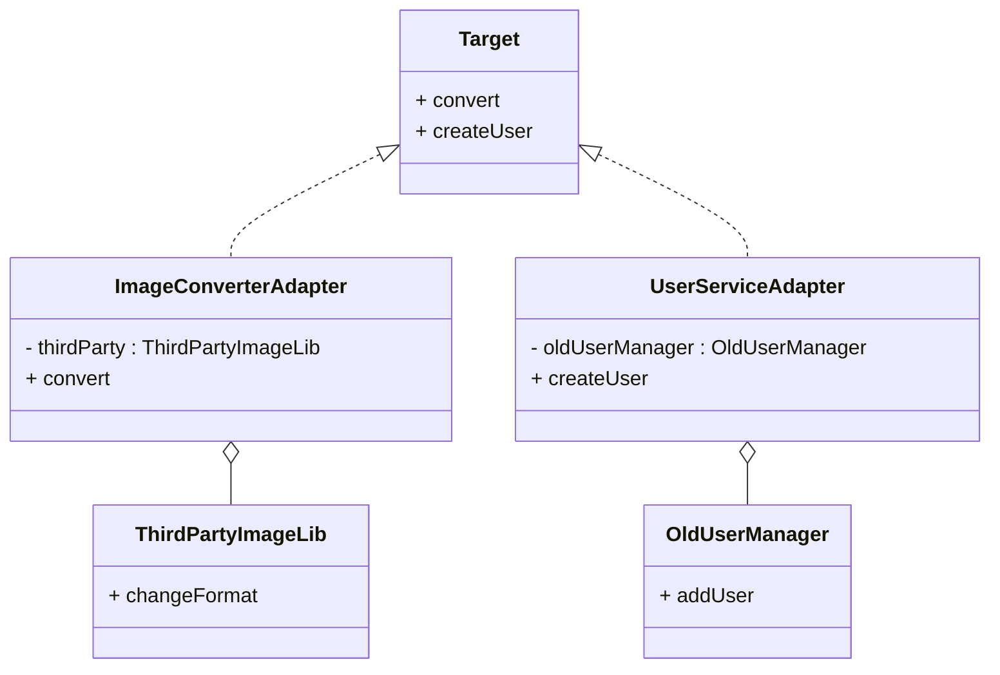

# Design Patterns de Structure (Partie 1)  
## Adapter : Cas d’usage – Intégration de bibliothèques tierces et migration de code

Le pattern **Adapter** facilite la collaboration entre des composants dont les interfaces sont incompatibles, un besoin courant lors de l’intégration de bibliothèques externes ou la migration / refonte de systèmes existants.

---

## Intégration de bibliothèques tierces

Lorsqu’une application utilise une bibliothèque tierce, il arrive souvent que l'interface de cette bibliothèque ne corresponde pas à celle attendue par l’application. Modifier la bibliothèque n’est pas possible ou recommandé car elle est souvent fournie en version tierce, stable et indépendante.

L’Adapter fait le rôle de **pont**, en encapsulant la bibliothèque et en fournissant une interface compatible à l’application.

### Exemple : adaptation d’une bibliothèque de conversion d’images

Supposons qu’une application attende une interface simple de conversion d’image :

```java
public interface ImageConverter {
    void convert(String sourcePath, String destPath);
}
```

La bibliothèque tierce a une interface différente :

```java
class ThirdPartyImageLib {
    public void changeFormat(String inputFile, String outputFile, String type) {
        System.out.println("Conversion en " + type + " : " + inputFile + " -> " + outputFile);
    }
}
```

Adapter la bibliothèque :

```java
public class ImageConverterAdapter implements ImageConverter {
    private ThirdPartyImageLib thirdParty;

    public ImageConverterAdapter(ThirdPartyImageLib thirdParty) {
        this.thirdParty = thirdParty;
    }

    @Override
    public void convert(String sourcePath, String destPath) {
        // Par exemple, toujours convertir en PNG
        thirdParty.changeFormat(sourcePath, destPath, "PNG");
    }
}
```

Utilisation dans l’application principale :

```java
public class App {
    public static void main(String[] args) {
        ThirdPartyImageLib lib = new ThirdPartyImageLib();
        ImageConverter converter = new ImageConverterAdapter(lib);

        converter.convert("photo.jpg", "photo_converted.png");
    }
}
```

---

## Migration de code existant

Lors d’une **migration** ou d’une refonte, certaines parties d’un ancien système doivent être conservées faute de pouvoir tout réécrire simultanément. Souvent, l’ancienne API ne correspond plus aux nouvelles spécifications.

L’adaptateur permet d’encapsuler l’implémentation ancienne, en fournissant la nouvelle interface attendue.

### Exemple : migration progressive d’une API de gestion des utilisateurs

Ancienne classe :

```java
class OldUserManager {
    public void addUser(String username) {
        System.out.println("Utilisateur " + username + " ajouté dans l'ancien système");
    }
}
```

Nouvelle interface cible :

```java
interface UserService {
    void createUser(String username);
}
```

Adaptateur pour faire interlocuteur :

```java
class UserServiceAdapter implements UserService {
    private OldUserManager oldUserManager;

    public UserServiceAdapter(OldUserManager oldUserManager) {
        this.oldUserManager = oldUserManager;
    }

    public void createUser(String username) {
        oldUserManager.addUser(username);
    }
}
```

Cela permet à la nouvelle application d'utiliser le système ancien sans modifier son code.

---

## Diagramme illustratif



---

## Résumé

| Cas d’usage                     | Rôle de l’Adapter                          |
|--------------------------------|--------------------------------------------|
| Intégration de bibliothèques tierces | Adaptation d’une interface tierce pour qu’elle corresponde à l’interface client |
| Migration/réécriture progressive | Encapsulation de l’ancien système sous la nouvelle interface pour compatibilité |

---

## Sources

- [Refactoring.Guru – Adapter Pattern](https://refactoring.guru/design-patterns/adapter)  
- [Wikipedia – Adapter Pattern](https://en.wikipedia.org/wiki/Adapter_pattern)  
- Gamma E., Helm R., Johnson R., Vlissides J., *Design Patterns: Elements of Reusable Object-Oriented Software*, Addison-Wesley, 1994.

---

L’adaptateur joue un rôle clé dans la modernisation et la maintenance des systèmes logiciels, en assurant une intégration fluide sans modifier les composants tiers ou hérités, minimisant ainsi les risques et coûts de réécriture.