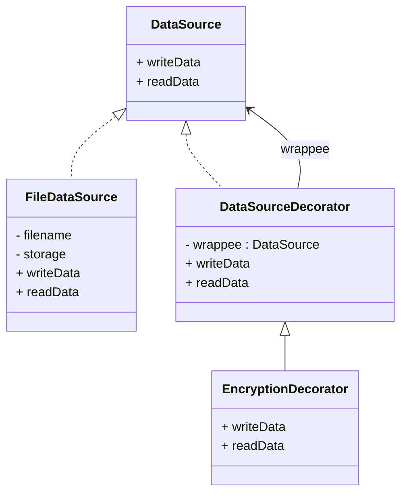

# Design Patterns de Structure (Partie 1)  
## Decorator : définition et intention

Le pattern **Decorator** permet d’ajouter dynamiquement des responsabilités ou comportements supplémentaires à un objet sans modifier sa structure. Il s’agit d’une alternative souple à la sous-classe pour étendre les fonctionnalités d’un objet.

---

## Définition

Le Decorator est un pattern structurel qui enveloppe un objet original dans un autre objet décorateur, qui implémente la même interface. Grâce à cette composition, le décorateur peut intercepter, modifier, ou compléter les appels à l’objet original.

---

## Intention

- Ajouter des fonctionnalités à un objet à l’exécution, sans créer une hiérarchie de sous-classes compliquée.  
- Permettre une extension flexible et modulaire des comportements.  
- Respecter le principe de responsabilité unique en cloisonnant les ajouts dans des décorateurs spécifiques.

---

## Exemple concret : ajout de fonctionnalités à un flux d’entrée/sortie (Java I/O inspired)

### Interface de base

```java
public interface DataSource {
    void writeData(String data);
    String readData();
}
```

### Classe concrète (composant de base)

```java
public class FileDataSource implements DataSource {
    private String filename;
    private String storage = "";

    public FileDataSource(String filename) {
        this.filename = filename;
    }

    @Override
    public void writeData(String data) {
        // Simule l’écriture dans un fichier
        storage = data;
    }

    @Override
    public String readData() {
        return storage;
    }
}
```

### Décorateur abstrait

```java
public class DataSourceDecorator implements DataSource {
    protected DataSource wrappee;

    public DataSourceDecorator(DataSource source) {
        this.wrappee = source;
    }

    @Override
    public void writeData(String data) {
        wrappee.writeData(data);
    }

    @Override
    public String readData() {
        return wrappee.readData();
    }
}
```

### Décorateur concret : chiffrement simple

```java
public class EncryptionDecorator extends DataSourceDecorator {

    public EncryptionDecorator(DataSource source) {
        super(source);
    }

    @Override
    public void writeData(String data) {
        String encrypted = "ENCRYPT(" + data + ")";
        super.writeData(encrypted);
    }

    @Override
    public String readData() {
        String data = super.readData();
        return data.replace("ENCRYPT(", "").replace(")", "");
    }
}
```

### Utilisation

```java
public class Client {
    public static void main(String[] args) {
        DataSource fileSource = new FileDataSource("file.txt");
        DataSource encryptedSource = new EncryptionDecorator(fileSource);

        encryptedSource.writeData("mySensitiveData");
        System.out.println(encryptedSource.readData());  // Affiche : mySensitiveData
    }
}
```

---

## Diagramme



---

## Résumé

| Aspect               | Decorator                                   |
|----------------------|---------------------------------------------|
| But                  | Ajouter dynamiquement des responsabilités   |
| Structure            | Composition (objets décorateurs enveloppent l’objet) |
| Extensibilité         | Très élevée, sans multiplier les sous-classes |
| Couplage             | Faible, permet séparation des responsabilités |
| Domaine d’application | Bibliothèques I/O, interfaces graphiques, logs, ...

---

## Sources et références

- [Refactoring.Guru – Decorator Pattern](https://refactoring.guru/design-patterns/decorator)  
- [Wikipedia – Decorator pattern](https://en.wikipedia.org/wiki/Decorator_pattern)  
- Gamma E., Helm R., Johnson R., Vlissides J., *Design Patterns: Elements of Reusable Object-Oriented Software*, Addison-Wesley, 1994.

---

Le pattern Decorator offre une méthode élégante pour enrichir les fonctionnalités d’un objet à l’exécution sans le rigidifier par une hiérarchie complexe de classes. Il favorise la modularité, la réutilisabilité et un code plus maintenable.