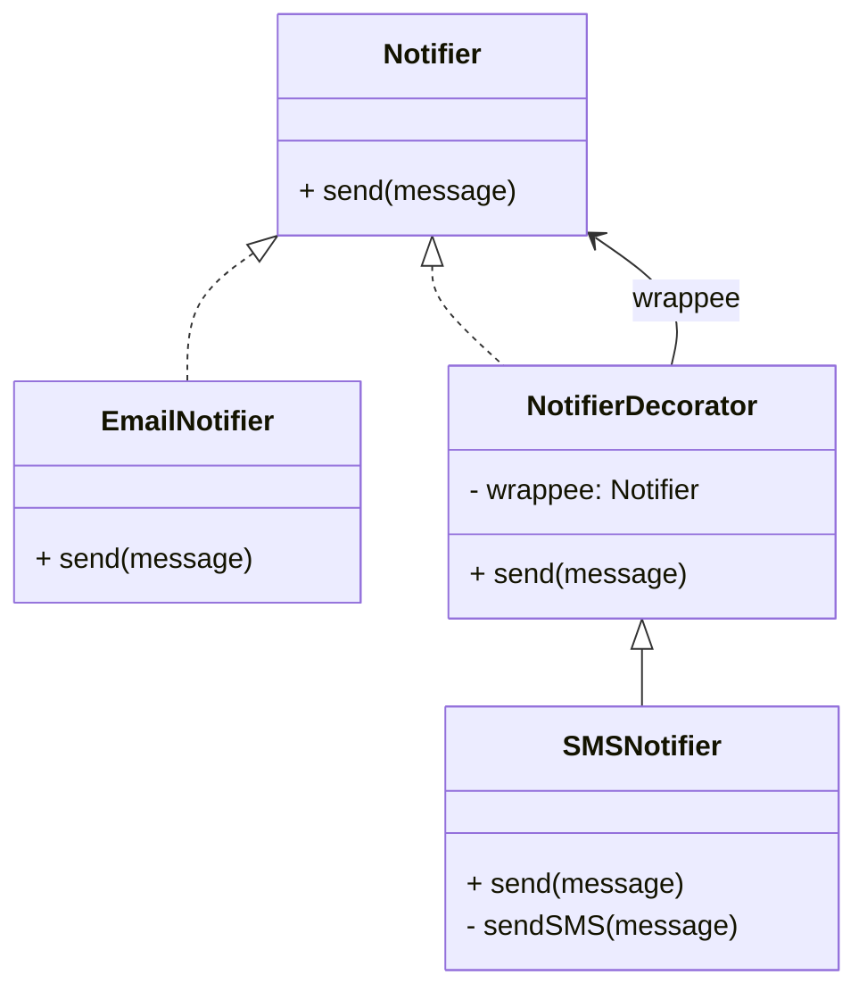

# Design Patterns de Structure (Partie 1)  
## Decorator : principe d’encapsulation et composition

Le pattern **Decorator** repose sur deux concepts clés : **l’encapsulation** et la **composition**. Ces principes garantissent l’ajout dynamique et transparent de fonctionnalités à un objet existant, sans modifier ce dernier ni multiplier une hiérarchie de sous-classes.

---

## Encapsulation dans le Decorator

L’encapsulation consiste à cacher l’objet original à l’intérieur du décorateur. Ce dernier **intercepte les appels des clients** et peut les modifier, étendre ou filtrer avant (ou après) de les déléguer à l’objet encapsulé.

L’objet traversant reste conforme à l’interface attendue mais son comportement peut être enrichi à la volée.

---

## Composition : fondement structurel du pattern

Plutôt que d’utiliser un héritage (qui serait statique), le décorateur utilise la **composition**, c’est-à-dire qu’il contient une référence à l’objet décoré. Voilà la clé de la flexibilité :

- Le décorateur implémente la même interface que l’objet original.  
- Il **contient une instance** de cette interface (comportant l’objet à décorer).  
- Lorsqu’une méthode est appelée sur le décorateur, celui-ci peut :  
  - compléter ou modifier le comportement,  
  - puis déléguer (forward) l’appel à l’objet interne.  

La composition permet d’empiler plusieurs décorateurs sur un même objet, chacun ajoutant une responsabilité.

---

## Illustration avec un exemple simple (en Java) — Système de notifications

### Interface commune

```java
public interface Notifier {
    void send(String message);
}
```

### Classe concrète (base)

```java
public class EmailNotifier implements Notifier {
    public void send(String message) {
        System.out.println("Envoi de mail: " + message);
    }
}
```

### Décorateur abstrait

```java
public abstract class NotifierDecorator implements Notifier {
    protected Notifier wrappee;

    public NotifierDecorator(Notifier notifier) {
        this.wrappee = notifier;
    }

    public void send(String message) {
        wrappee.send(message);
    }
}
```

### Décorateur concret — ajout SMS

```java
public class SMSNotifier extends NotifierDecorator {

    public SMSNotifier(Notifier notifier) {
        super(notifier);
    }

    @Override
    public void send(String message) {
        super.send(message);
        sendSMS(message);
    }

    private void sendSMS(String message) {
        System.out.println("Envoi de SMS: " + message);
    }
}
```

### Utilisation

```java
public class Client {
    public static void main(String[] args) {
        Notifier notifier = new EmailNotifier();
        
        // Ajout dynamique d’un comportement SMS
        Notifier smsNotifier = new SMSNotifier(notifier);
        
        smsNotifier.send("Hello Decorator!");
        // Output :
        // Envoi de mail: Hello Decorator!
        // Envoi de SMS: Hello Decorator!
    }
}
```

---

## Diagramme Mermaid



---

## Points clés

| Concept          | Explication                                      |
|------------------|-------------------------------------------------|
| **Encapsulation**| Le décorateur cache l’objet original auquel il délègue les appels. |
| **Composition**  | Le décorateur possède une référence à un objet de même interface, ce qui rend le comportement modifiable à la volée. |
| **Extensibilité**| Plusieurs décorateurs peuvent être empilés pour enrichir un objet. |
| **Faible couplage** | Le décorateur manipule l’objet via son interface, limitant la dépendance à une implémentation concrète. |

---

## Sources

- [Refactoring.Guru – Decorator Pattern](https://refactoring.guru/design-patterns/decorator)  
- [Wikipedia – Decorator pattern](https://en.wikipedia.org/wiki/Decorator_pattern)  
- Gamma E., Helm R., Johnson R., Vlissides J., *Design Patterns: Elements of Reusable Object-Oriented Software*, Addison-Wesley, 1994.

---

Grâce à l’encapsulation et à la composition, le pattern Decorator met en place un mécanisme puissant permettant d’enrichir les objets de manière modulaire, favorisant la réutilisabilité et la maintenance du code.