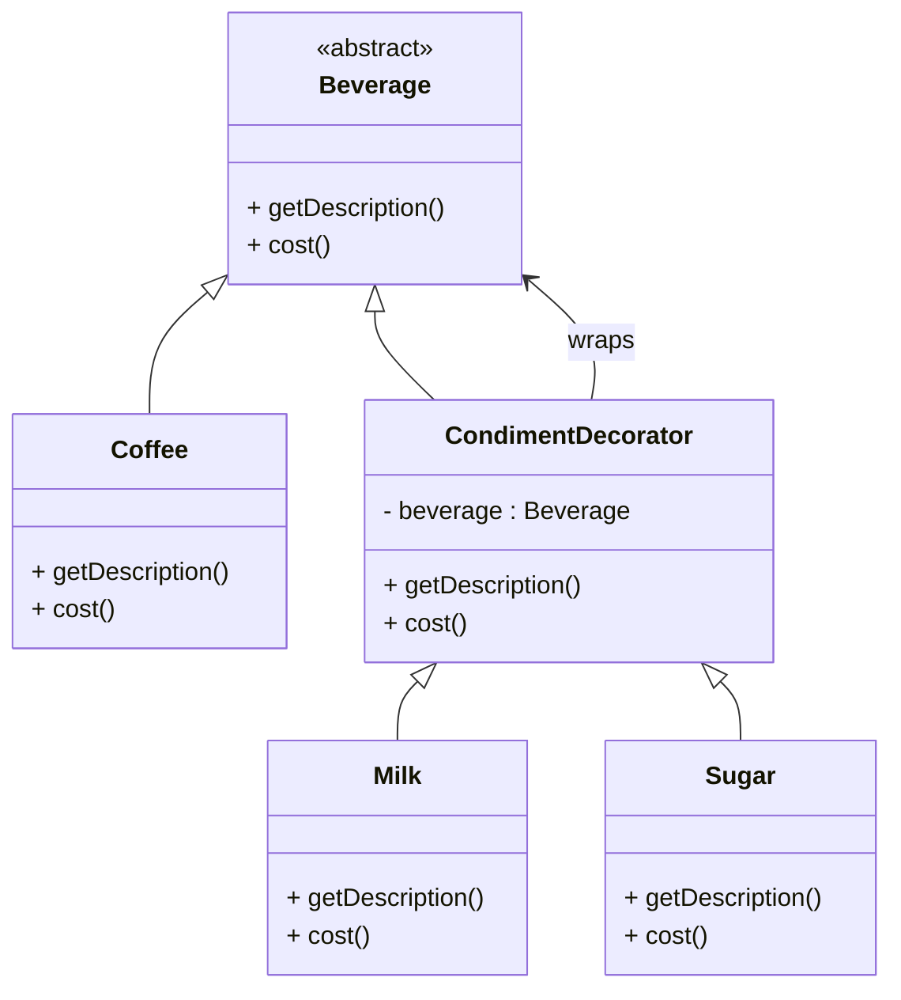

# Design Patterns de Structure (Partie 1)  
## Decorator : différence avec l’héritage et avantages en termes de flexibilité

Le pattern **Decorator** est souvent comparé à l’extension par héritage pour ajouter des fonctionnalités à une classe. Pourtant, leur approche et leurs implications sont très différentes, notamment en termes de flexibilité et de maintenance.

---

## Héritage vs Decorator : approches différentes pour étendre un comportement

### Héritage

L’héritage permet de créer une nouvelle classe dérivée qui étend ou modifie le comportement de la classe parent.  

**Caractéristiques :**  
- Extension statique à la compilation.  
- Nécessite une hiérarchie de classes si multiples combinaisons de fonctionnalités sont souhaitées.  
- Provoque souvent une explosion du nombre de sous-classes (diapositives en diamant, complexité accrue).  
- Comportement *figé* dans la classe héritée.  

### Decorator

Le Decorator repose sur la composition et l’encapsulation pour **ajouter dynamiquement** des responsabilités à un objet à l’exécution.

**Caractéristiques :**  
- Extension dynamique du comportement.  
- Permet d’empiler plusieurs décorateurs pour combinaisons flexibles.  
- Évite la multiplication des sous-classes.  
- Permet d’ajouter ou retirer facilement des fonctionnalités sans modifier la classe originale.

---

## Illustration par un exemple simple

Imaginez un système qui représente des boissons avec différents ajouts (lait, sucre).

### Par héritage — explosion des classes

```java
class Beverage {
    String getDescription() { return "Boisson"; }
    double cost() { return 1.0; }
}

class Coffee extends Beverage {
    @Override
    String getDescription() { return "Café"; }
    @Override
    double cost() { return 2.0; }
}

class CoffeeWithMilk extends Coffee {
    @Override
    String getDescription() { return super.getDescription() + ", lait"; }
    @Override
    double cost() { return super.cost() + 0.5; }
}

class CoffeeWithMilkAndSugar extends CoffeeWithMilk {
    @Override
    String getDescription() { return super.getDescription() + ", sucre"; }
    @Override
    double cost() { return super.cost() + 0.3; }
}
// Et ainsi de suite pour toutes combinaisons
```

**Inconvénients :** multiplication des classes pour toutes combinaisons d’options.

---

### Avec Decorator — composition dynamique

```java
abstract class Beverage {
    abstract String getDescription();
    abstract double cost();
}

class Coffee extends Beverage {
    String getDescription() { return "Café"; }
    double cost() { return 2.0; }
}

abstract class CondimentDecorator extends Beverage {
    protected Beverage beverage;
    CondimentDecorator(Beverage beverage) { this.beverage = beverage; }
}

class Milk extends CondimentDecorator {
    Milk(Beverage beverage) { super(beverage); }
    String getDescription() { return beverage.getDescription() + ", lait"; }
    double cost() { return beverage.cost() + 0.5; }
}

class Sugar extends CondimentDecorator {
    Sugar(Beverage beverage) { super(beverage); }
    String getDescription() { return beverage.getDescription() + ", sucre"; }
    double cost() { return beverage.cost() + 0.3; }
}
```

**Utilisation dynamique :**

```java
Beverage beverage = new Coffee();
beverage = new Milk(beverage);
beverage = new Sugar(beverage);

System.out.println(beverage.getDescription() + " €" + beverage.cost());
// Sortie : "Café, lait, sucre €2.8"
```

---

## Diagramme Mermaid



---

## Avantages du Decorator par rapport à l’héritage

| Critère                   | Héritage                              | Decorator                              |
|----------------------------|-------------------------------------|---------------------------------------|
| Extensibilité              | Statique, nécessite création de nombreuses sous-classes | Dynamique, empilement et combinaison flexibles |
| Nombre de classes          | Explosif en présence de multiples combinaisons | Réduit grâce à l’usage de décorateurs composables |
| Couplage                  | Fort entre la classe parent et fille  | Faible, découplage via l’interface et la composition |
| Modification à la volée    | Impossible                           | Possible, modification dynamique du comportement à l’exécution |
| Maintenance               | Complexe pour les hiérarchies étendues | Plus simple grâce à la modularité    |

---

## Sources

- [Refactoring.Guru – Decorator Pattern](https://refactoring.guru/design-patterns/decorator)  
- [Wikipedia – Decorator pattern](https://en.wikipedia.org/wiki/Decorator_pattern)  
- Gamma E., Helm R., Johnson R., Vlissides J., *Design Patterns: Elements of Reusable Object-Oriented Software*, Addison-Wesley, 1994.

---

La composition via le pattern Decorator offre une alternative élégante à l’héritage pour l’extension des fonctionnalités, offrant souplesse, modularité et maintenance facilitée.