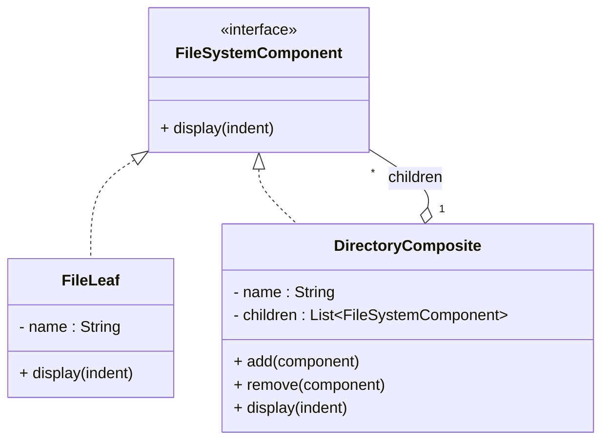

# Design Patterns de Structure (Partie 2) & Comportement (Partie 1)  
## Composite : Définition et intention  

Le pattern **Composite** organise des objets en structures arborescentes où chaque élément peut être soit un objet simple (feuille), soit une composition d’objets (nœud). Cette organisation permet de traiter de manière uniforme à la fois les composants simples et les compositions complexes.  

---

## Définition

Composite est un pattern structurel qui facilite le travail sur des hiérarchies récursives d’objets. Il définit une interface commune à tous les objets, de sorte qu’ils puissent être manipulés individuellement ou collectivement de façon identique.

---

## Intention

- **Composer** des objets en structures arborescentes.  
- **Traiter uniformément** les objets individuels (feuilles) et les compositions d’objets (nœuds).  
- Simplifier la gestion des structures complexes sans exposer la distinction entre feuilles et composites.  

---

## Exemple concret : système de fichiers (répertoire/fichiers)

### Interface commune

```java
public interface FileSystemComponent {
    void display(String indent);
}
```

### Composant feuille (fichier)

```java
public class FileLeaf implements FileSystemComponent {
    private String name;

    public FileLeaf(String name) {
        this.name = name;
    }

    @Override
    public void display(String indent) {
        System.out.println(indent + "- " + name);
    }
}
```

### Composant composite (répertoire)

```java
import java.util.ArrayList;
import java.util.List;

public class DirectoryComposite implements FileSystemComponent {
    private String name;
    private List<FileSystemComponent> children = new ArrayList<>();

    public DirectoryComposite(String name) {
        this.name = name;
    }

    public void add(FileSystemComponent component) {
        children.add(component);
    }

    public void remove(FileSystemComponent component) {
        children.remove(component);
    }

    @Override
    public void display(String indent) {
        System.out.println(indent + "+ " + name);
        for (FileSystemComponent child : children) {
            child.display(indent + "  ");
        }
    }
}
```

### Utilisation

```java
public class Client {
    public static void main(String[] args) {
        DirectoryComposite root = new DirectoryComposite("root");
        FileLeaf file1 = new FileLeaf("file1.txt");
        FileLeaf file2 = new FileLeaf("file2.txt");
        DirectoryComposite subdir = new DirectoryComposite("subdir");
        FileLeaf file3 = new FileLeaf("file3.txt");

        root.add(file1);
        root.add(subdir);
        subdir.add(file2);
        subdir.add(file3);

        root.display("");
    }
}
```

**Sortie :**

```
+ root
  - file1.txt
  + subdir
    - file2.txt
    - file3.txt
```

---

## Diagramme Mermaid



---

## Points clés

| Concept               | Description                                      |
|-----------------------|-------------------------------------------------|
| Structure arborescente | Le composite organise les objets en arbres récursifs. |
| Interface commune      | Feuilles et composites partagent la même interface.  |
| Transparence           | Le client manipule les composants sans distinction explicite entre feuilles et composites. |
| Simplification         | Réduit la complexité de manipulation des structures complexes. |

---

## Sources

- [Refactoring.Guru – Composite Pattern](https://refactoring.guru/design-patterns/composite)  
- [Wikipedia – Composite Pattern](https://en.wikipedia.org/wiki/Composite_pattern)  
- Gamma E., Helm R., Johnson R., Vlissides J., *Design Patterns: Elements of Reusable Object-Oriented Software*, Addison-Wesley, 1994.

---

Le pattern Composite facilite la conception de systèmes où les objets peuvent être groupés sous forme d’arbres, permettant un traitement homogène des objets simples et des ensembles complexes.