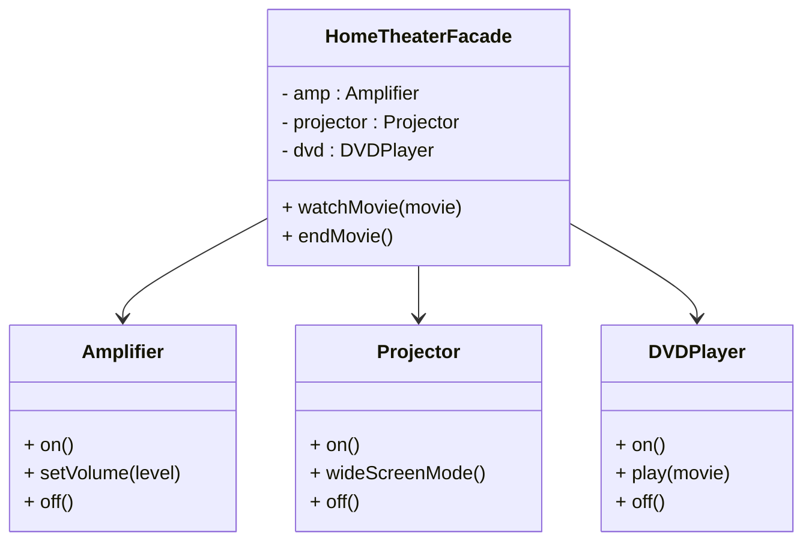

# Design Patterns de Structure (Partie 2) & Comportement (Partie 1)  
## Facade : Définition et intention

Le pattern **Facade** vise à simplifier l’utilisation d’un système complexe en fournissant une interface unifiée et plus simple pour un ensemble d’interfaces dans un sous-système. Il masque la complexité des interactions internes et facilite l’accès aux fonctionnalités essentielles.

---

## Définition

Une **Facade** est un objet qui sert d'interface simplifiée pour un ensemble de classes ou de sous-systèmes complexes. Elle réduit le couplage entre le client et les sous-systèmes en encapsulant la complexité interne derrière une interface claire.

---

## Intention

- Fournir une interface simple, cohérente et réduite pour interagir avec un ensemble complexe de classes.  
- Découpler le client des détails complexes d’un sous-système.  
- Faciliter la maintenance et l’évolution du système en limitant les points d’accès.  
- Améliorer la lisibilité et la clarté du code client.

---

## Exemple concret : système de home cinéma

Un système de home cinéma typique comporte plusieurs composants : lecteur Blu-ray, projecteur, écran, amplificateur, lumière, etc. Chacun a sa propre interface.

### Sous-systèmes (extraits)

```java
class Amplifier {
    public void on() { System.out.println("Amplificateur ON"); }
    public void setVolume(int level) { System.out.println("Volume réglé à " + level); }
    public void off() { System.out.println("Amplificateur OFF"); }
}

class Projector {
    public void on() { System.out.println("Projecteur ON"); }
    public void wideScreenMode() { System.out.println("Format écran large activé"); }
    public void off() { System.out.println("Projecteur OFF"); }
}

class DVDPlayer {
    public void on() { System.out.println("Lecteur DVD ON"); }
    public void play(String movie) { System.out.println("Lecture du film : " + movie); }
    public void off() { System.out.println("Lecteur DVD OFF"); }
}
```

### Facade

```java
public class HomeTheaterFacade {
    private Amplifier amp;
    private Projector projector;
    private DVDPlayer dvd;

    public HomeTheaterFacade(Amplifier amp, Projector projector, DVDPlayer dvd) {
        this.amp = amp;
        this.projector = projector;
        this.dvd = dvd;
    }

    public void watchMovie(String movie) {
        System.out.println("Préparation pour regarder un film...");
        amp.on();
        amp.setVolume(5);
        projector.on();
        projector.wideScreenMode();
        dvd.on();
        dvd.play(movie);
    }

    public void endMovie() {
        System.out.println("Arrêt du film...");
        amp.off();
        projector.off();
        dvd.off();
    }
}
```

### Usage client

```java
public class Client {
    public static void main(String[] args) {
        Amplifier amp = new Amplifier();
        Projector projector = new Projector();
        DVDPlayer dvd = new DVDPlayer();
        HomeTheaterFacade homeTheater = new HomeTheaterFacade(amp, projector, dvd);

        homeTheater.watchMovie("Inception");
        // ...
        homeTheater.endMovie();
    }
}
```

---

## Diagramme Mermaid



---

## Résumé

| Aspect                 | Description                                            |
|------------------------|--------------------------------------------------------|
| But                    | Simplifier l’utilisation d’un sous-système complexe   |
| Interface              | Interface unifiée et réduite pour le client            |
| Couplage               | Découplage entre client et sous-système                |
| Facilité               | Facilite la compréhension, l’utilisation et la maintenance |
| Usage fréquent         | APIs, frameworks, systèmes multi-composants            |

---

## Sources

- [Refactoring.Guru – Facade Pattern](https://refactoring.guru/design-patterns/facade)  
- [Wikipedia – Facade pattern](https://en.wikipedia.org/wiki/Facade_pattern)  
- Gamma E., Helm R., Johnson R., Vlissides J., *Design Patterns: Elements of Reusable Object-Oriented Software*, Addison-Wesley, 1994.

---

La Facade est l’un des patterns structurels les plus utilisés pour masquer la complexité et réduire l’impact des changements internes sur les clients, améliorant la lisibilité et facilitant l’intégration des sous-systèmes.