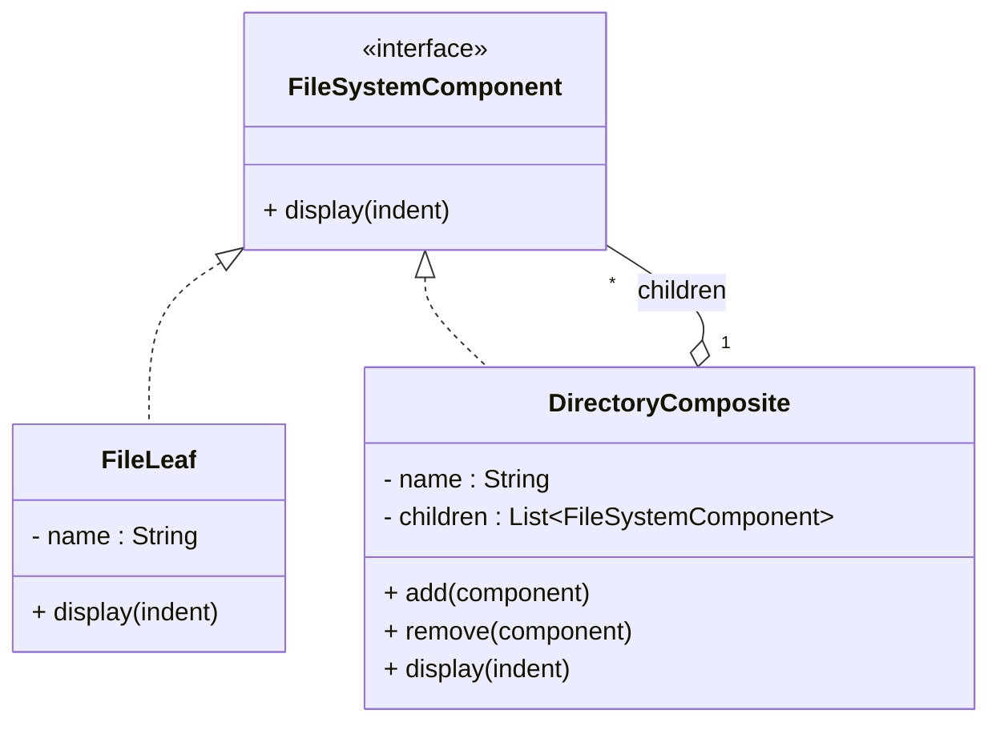
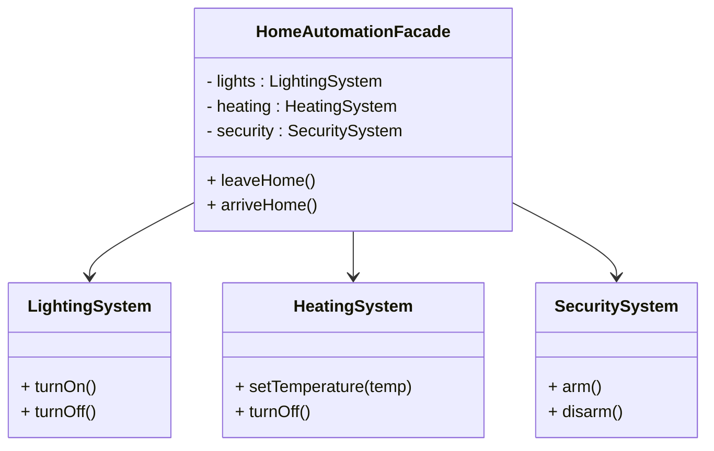

# Design Patterns de Structure (Partie 2) & Comportement (Partie 1)  
## Cas d’usage du Composite et du Facade

Les patterns **Composite** et **Facade** répondent à des besoins complémentaires dans la conception logicielle. Le Composite sert à gérer des structures arborescentes d’objets que l’on souhaite manipuler uniformément, tandis que la Facade simplifie l’interface d’un sous-système complexe pour ses utilisateurs. Voici des cas d’usage concrets illustrant ces patterns.

---

## Composite : gestion d’arbres et systèmes de fichiers

### Cas d’usage principal : systèmes de fichiers

Un système de fichiers repose naturellement sur une structure hiérarchique d’éléments : **répertoires** (conteneurs) et **fichiers** (feuilles). Le pattern Composite permet de représenter cette structure en facilitant :  

- La manipulation uniforme des fichiers et des répertoires.  
- L’ajout, suppression et affichage récursif.  

---

### Exemple simplifié : système de fichiers (Java)

```java
interface FileSystemComponent {
    void display(String indent);
}

class FileLeaf implements FileSystemComponent {
    private String name;

    public FileLeaf(String name) { this.name = name; }

    @Override
    public void display(String indent) {
        System.out.println(indent + "- " + name);
    }
}

class DirectoryComposite implements FileSystemComponent {
    private String name;
    private List<FileSystemComponent> children = new ArrayList<>();

    public DirectoryComposite(String name) { this.name = name; }

    public void add(FileSystemComponent component) { children.add(component); }
    public void remove(FileSystemComponent component) { children.remove(component); }

    @Override
    public void display(String indent) {
        System.out.println(indent + "+ " + name);
        for (FileSystemComponent child : children) {
            child.display(indent + "  ");
        }
    }
}
```

---

### Illustration avec Mermaid



---

## Facade : simplification d’interfaces complexes

### Cas d’usage principal : interfaces simplifiées pour sous-systèmes

Dans tout système comportant plusieurs modules ou sous-systèmes, le client peut être perdu par la complexité ou le nombre d’interactions nécessaires. La Facade propose une interface unique, intuitive, réduisant les besoins en connaissance du système interne.  

Exemples typiques :  
- Systèmes de home cinéma (amplificateur, projecteur, lecteur DVD).  
- Frameworks et bibliothèques complexes.  
- Services web multiplateformes.

---

### Exemple simplifié : façade pour un système domotique

```java
class LightingSystem {
    void turnOn() { System.out.println("Lumières allumées"); }
    void turnOff() { System.out.println("Lumières éteintes"); }
}

class HeatingSystem {
    void setTemperature(int temp) { System.out.println("Chauffage réglé à " + temp + "°C"); }
    void turnOff() { System.out.println("Chauffage éteint"); }
}

class SecuritySystem {
    void arm() { System.out.println("Alarme activée"); }
    void disarm() { System.out.println("Alarme désactivée"); }
}

class HomeAutomationFacade {
    private LightingSystem lights = new LightingSystem();
    private HeatingSystem heating = new HeatingSystem();
    private SecuritySystem security = new SecuritySystem();

    public void leaveHome() {
        lights.turnOff();
        heating.turnOff();
        security.arm();
        System.out.println("Maison sécurisée.");
    }

    public void arriveHome() {
        lights.turnOn();
        heating.setTemperature(22);
        security.disarm();
        System.out.println("Bienvenue chez vous !");
    }
}
```

---

### Diagramme Mermaid



---

## Résumé comparatif des cas d’usage

| Pattern       | Objectif                                  | Exemple de domaine             | Bénéfices |
|---------------|-------------------------------------------|-------------------------------|-----------|
| **Composite** | Gérer des structures hiérarchiques       | Systèmes de fichiers, UI (ex : composants graphiques) | Uniformité, simplicité de traitement récursif |
| **Facade**    | Simplifier les interactions complexes     | Domotique, systèmes multimédia, frameworks | Interface claire, découplage, maintenance facilitée |

---

## Sources

- [Refactoring.Guru – Composite Pattern](https://refactoring.guru/design-patterns/composite)  
- [Refactoring.Guru – Facade Pattern](https://refactoring.guru/design-patterns/facade)  
- [Wikipedia – Composite pattern](https://en.wikipedia.org/wiki/Composite_pattern)  
- [Wikipedia – Facade pattern](https://en.wikipedia.org/wiki/Facade_pattern)  
- Gamma E., Helm R., Johnson R., Vlissides J., *Design Patterns: Elements of Reusable Object-Oriented Software*, Addison-Wesley, 1994.

---

Les patterns Composite et Facade répondent à des besoins complémentaires dans la conception logicielle : le Composite organise les objets en structures arborescentes simples à manipuler, et la Facade offre une interface accessible pour interagir avec des systèmes complexes. Leur usage améliore la clarté, la réutilisabilité et la maintenabilité du code.