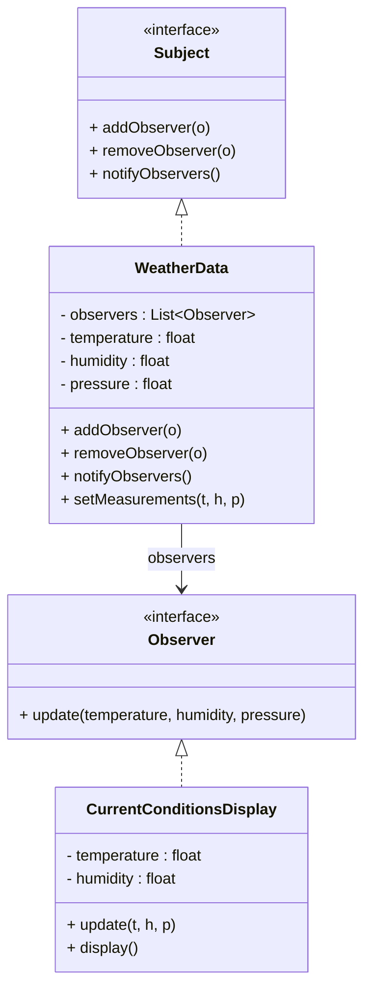

# Design Patterns de Structure (Partie 2) & Comportement (Partie 1)  
## Observer : définition et intention

Le **pattern Observer** établit une relation de dépendance un-à-plusieurs entre objets. Lorsqu'un objet (le sujet) change d’état, tous ses objets dépendants (les observateurs) sont automatiquement notifiés et mis à jour. Ce mécanisme permet de maintenir la cohérence entre objets sans couplage fort.

---

## Définition

L’Observer organise la communication entre un objet source (Subject) et plusieurs objets cibles (Observers) de manière réactive :

- Le **Subject** maintient une liste d’observateurs intéressés par son état.  
- Lors d’un changement d’état, il **notifie** tous les observateurs.  
- Chaque **Observer** implémente une méthode pour recevoir et traiter cette notification.  

Cette architecture favorise la séparation des responsabilités et facilite l’extension du système.

---

## Intention

- Définir une dépendance un-à-plusieurs entre objets.  
- Notifier automatiquement les objets concernés lors d’un changement d’état.  
- Permettre un couplage faible entre le sujet et ses observateurs.  
- Permettre à des objets d’être ajoutés ou supprimés dynamiquement comme observateurs.

---

## Exemple concret : gestion d’un système météo (Java)

### Interface Subject

```java
import java.util.*;

interface Subject {
    void addObserver(Observer o);
    void removeObserver(Observer o);
    void notifyObservers();
}
```

### Interface Observer

```java
interface Observer {
    void update(float temperature, float humidity, float pressure);
}
```

### Implémentation concrète du Subject

```java
class WeatherData implements Subject {
    private List<Observer> observers = new ArrayList<>();
    private float temperature;
    private float humidity;
    private float pressure;

    public void addObserver(Observer o) {
        observers.add(o);
    }

    public void removeObserver(Observer o) {
        observers.remove(o);
    }

    public void notifyObservers() {
        for (Observer o : observers) {
            o.update(temperature, humidity, pressure);
        }
    }

    public void measurementsChanged() {
        notifyObservers();
    }

    public void setMeasurements(float temperature, float humidity, float pressure) {
        this.temperature = temperature;
        this.humidity = humidity;
        this.pressure = pressure;
        measurementsChanged();
    }
}
```

### Implémentation concrète d’un Observer

```java
class CurrentConditionsDisplay implements Observer {
    private float temperature;
    private float humidity;

    public void update(float temperature, float humidity, float pressure) {
        this.temperature = temperature;
        this.humidity = humidity;
        display();
    }

    public void display() {
        System.out.println("Conditions actuelles : " + temperature + "°C et humidité " + humidity + "%");
    }
}
```

### Utilisation

```java
public class Client {
    public static void main(String[] args) {
        WeatherData weatherData = new WeatherData();
        CurrentConditionsDisplay currentDisplay = new CurrentConditionsDisplay();

        weatherData.addObserver(currentDisplay);
        weatherData.setMeasurements(25.0f, 65.0f, 1013.1f);
        weatherData.setMeasurements(26.5f, 70.0f, 1012.5f);
    }
}
```

**Sortie :**

```
Conditions actuelles : 25.0°C et humidité 65.0%
Conditions actuelles : 26.5°C et humidité 70.0%
```

---

## Diagramme Mermaid



---

## Résumé

| Concept              | Description                                            |
|----------------------|--------------------------------------------------------|
| Sujet ("Subject")    | Entité observée dont l’état peut changer              |
| Observateurs ("Observer") | Entités dépendantes, mises à jour automatiquement    |
| Notification         | Le sujet informe tous les observateurs lors d’un changement |
| Couplage             | Faible, observateurs ne sont pas fortement liés au sujet |
| Usage collectif      | Interfaces graphiques, systèmes d’évènements, gestion d’état |

---

## Sources

- [Refactoring.Guru – Observer Pattern](https://refactoring.guru/design-patterns/observer)  
- [Wikipedia – Observer pattern](https://en.wikipedia.org/wiki/Observer_pattern)  
- Gamma E., Helm R., Johnson R., Vlissides J., *Design Patterns: Elements of Reusable Object-Oriented Software*, Addison-Wesley, 1994.

---

Le pattern Observer apporte une solution élégante pour synchroniser plusieurs objets en réponse aux changements d’état, particulièrement utile dans les architectures réactives et événementielles.