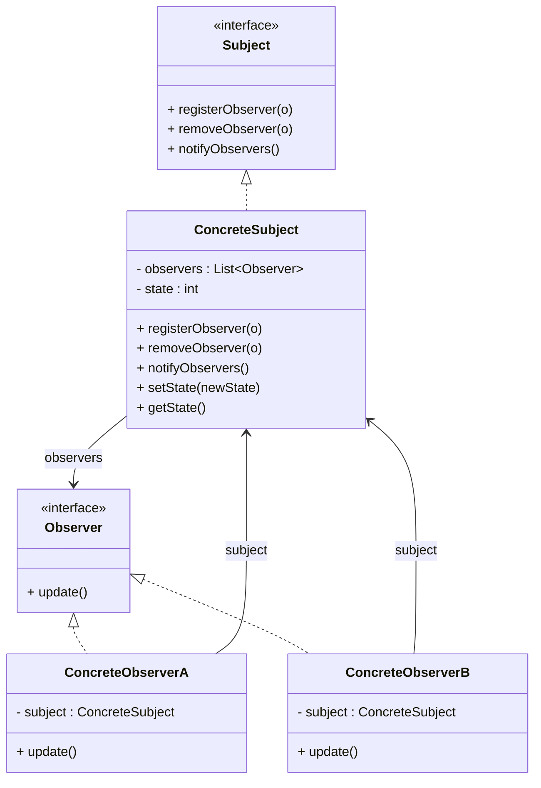

# Design Patterns de Structure (Partie 2) & Comportement (Partie 1)  
## Observer : implémentation du sujet et des observateurs

Le pattern **Observer** organise la communication entre un objet observé — appelé *sujet* (Subject) — et un ensemble d’objets dépendants, les *observateurs* (Observers). L’implémentation doit permettre la gestion dynamique des observateurs, ainsi qu’une notification efficace et cohérente lors des changements d’état du sujet.

---

## Architecture générale

L’implémentation du pattern Observer repose principalement sur deux abstractions :  
- **Sujet (Subject)** : maintient la liste des observateurs, fournit des méthodes pour les ajouter, retirer et notifier.  
- **Observateur (Observer)** : interface que devront implémenter toutes les classes voulant être informées des changements du sujet.  

---

## Définition des interfaces

```java
// Sujet qui notifie les observateurs
interface Subject {
    void registerObserver(Observer o);
    void removeObserver(Observer o);
    void notifyObservers();
}

// Observateur réagissant à une notification
interface Observer {
    void update();
}
```

Cette modélisation simplifiée permet une grande souplesse : les observateurs ignorent qui est le sujet, ils réagissent simplement à la notification.

---

## Implémentation d’un Sujet concret

```java
import java.util.ArrayList;
import java.util.List;

class ConcreteSubject implements Subject {
    private List<Observer> observers = new ArrayList<>();
    private int state;

    @Override
    public void registerObserver(Observer o) {
        observers.add(o);
    }

    @Override
    public void removeObserver(Observer o) {
        observers.remove(o);
    }

    @Override
    public void notifyObservers() {
        for (Observer observer : observers) {
            observer.update();
        }
    }

    // Méthode modifiant l'état et notifant les observateurs
    public void setState(int newState) {
        this.state = newState;
        notifyObservers();
    }

    public int getState() {
        return state;
    }
}
```

---

## Implémentation d’observateurs concrets

Les observateurs peuvent réagir différemment à la notification. Ils récupèrent souvent l’état du sujet pour actualiser leur propre état.

```java
class ConcreteObserverA implements Observer {
    private ConcreteSubject subject;

    public ConcreteObserverA(ConcreteSubject subject) {
        this.subject = subject;
        subject.registerObserver(this);
    }

    @Override
    public void update() {
        System.out.println("Observer A : état du sujet mis à jour : " + subject.getState());
    }
}

class ConcreteObserverB implements Observer {
    private ConcreteSubject subject;

    public ConcreteObserverB(ConcreteSubject subject) {
        this.subject = subject;
        subject.registerObserver(this);
    }

    @Override
    public void update() {
        System.out.println("Observer B : nouvelle valeur du sujet : " + subject.getState());
    }
}
```

---

## Extrait d’utilisation

```java
public class Client {
    public static void main(String[] args) {
        ConcreteSubject subject = new ConcreteSubject();

        ConcreteObserverA observerA = new ConcreteObserverA(subject);
        ConcreteObserverB observerB = new ConcreteObserverB(subject);

        subject.setState(10);
        subject.setState(20);

        subject.removeObserver(observerA);

        subject.setState(30);
    }
}
```

**Sortie attendue :**
```
Observer A : état du sujet mis à jour : 10
Observer B : nouvelle valeur du sujet : 10
Observer A : état du sujet mis à jour : 20
Observer B : nouvelle valeur du sujet : 20
Observer B : nouvelle valeur du sujet : 30
```

---

## Diagramme Mermaid



---

## Points à retenir

- Le sujet gère une collection dynamique d’observateurs, facilitant l’ajout et la suppression sans modifier la logique métier.  
- Les observateurs réagissent de manière indépendante, ce qui promeut un couplage faible.  
- L’actualisation de l’état se fait via une méthode dédiée, déclenchant la notification.  
- L’interface Observer peut accepter des paramètres, mais dans la forme simple, elle se contente d’appeler `update()`, l’observateur allant chercher l’état.

---

## Sources

- [Refactoring.Guru – Observer Pattern Implementation](https://refactoring.guru/design-patterns/observer/java/example)  
- [Wikipedia – Observer Pattern](https://en.wikipedia.org/wiki/Observer_pattern)  
- Gamma E., Helm R., Johnson R., Vlissides J., *Design Patterns: Elements of Reusable Object-Oriented Software*, Addison-Wesley, 1994.

---

L’implémentation classique du pattern Observer assure un mécanisme élégant de synchronisation entre objets, essentiel dans les systèmes réactifs, interfaces utilisateur, ou communication événements.