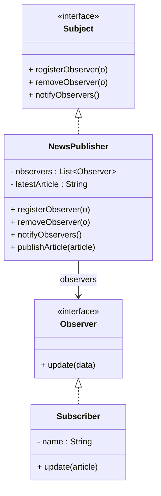

# Design Patterns de Structure (Partie 2) & Comportement (Partie 1)  
## Observer : cas d’usage – systèmes de notification et événements d’interface utilisateur

Le pattern **Observer** est essentiel pour gérer des situations où des objets doivent rester synchronisés sans couplage fort. En pratique, on le rencontre fréquemment dans les systèmes de notification et les interfaces utilisateur événementielles.

---

## Cas d’usage 1 : systèmes de notification

### Description

De nombreux systèmes nécessitent la diffusion d’informations à des abonnés ou clients : alertes SMS, notifications push, mises à jour des données en temps réel. L’Observer organise ces flux :

- Un **sujet** publie des événements (nouvelle info, changement d’état).  
- Les **observateurs** (abonnés, modules) reçoivent et traitent ces événements.

---

### Exemple simplifié

Imaginez une plateforme qui notifie les utilisateurs abonnés lors de la publication d’un article.

```java
interface Observer {
    void update(String article);
}

interface Subject {
    void registerObserver(Observer o);
    void removeObserver(Observer o);
    void notifyObservers();
}

class NewsPublisher implements Subject {
    private List<Observer> observers = new ArrayList<>();
    private String latestArticle;

    public void registerObserver(Observer o) { observers.add(o); }

    public void removeObserver(Observer o) { observers.remove(o); }

    public void notifyObservers() {
        for (Observer o : observers) {
            o.update(latestArticle);
        }
    }

    public void publishArticle(String article) {
        this.latestArticle = article;
        notifyObservers();
    }
}

class Subscriber implements Observer {
    private String name;

    public Subscriber(String name) { this.name = name; }

    @Override
    public void update(String article) {
        System.out.println("[" + name + "] Nouvel article: " + article);
    }
}
```

#### Utilisation

```java
NewsPublisher publisher = new NewsPublisher();
Subscriber alice = new Subscriber("Alice");
Subscriber bob = new Subscriber("Bob");

publisher.registerObserver(alice);
publisher.registerObserver(bob);

publisher.publishArticle("Design Patterns en Java");  
```

**Sortie :**

```
[Alice] Nouvel article: Design Patterns en Java
[Bob] Nouvel article: Design Patterns en Java
```

---

## Cas d’usage 2 : événements d’interface utilisateur (UI)

### Description

Les interfaces graphiques basées sur des événements adoptent souvent ce pattern. Par exemple :

- Boutons cliquables.  
- Saisies dans des champs de texte.  
- Modifications d’éléments GUI.  

Le sujet est ici un composant UI qui détecte un événement (clic, frappe clavier). Les observateurs sont des gestionnaires d’événements qui exécutent l’action correspondante.

---

### Exemple simplifié en pseudo-code

```java
interface EventListener {
    void onEvent();
}

class Button {
    private List<EventListener> listeners = new ArrayList<>();

    public void addListener(EventListener listener) { listeners.add(listener); }

    public void click() {
        System.out.println("Bouton cliqué");
        for (EventListener listener : listeners) {
            listener.onEvent();
        }
    }
}

class ClickHandler implements EventListener {
    private String handlerName;

    public ClickHandler(String name) { this.handlerName = name; }

    @Override
    public void onEvent() {
        System.out.println(handlerName + " gère l'événement du bouton");
    }
}
```

#### Utilisation

```java
Button button = new Button();
button.addListener(new ClickHandler("Handler1"));
button.addListener(new ClickHandler("Handler2"));

button.click();
```

**Sortie :**

```
Bouton cliqué
Handler1 gère l'événement du bouton
Handler2 gère l'événement du bouton
```

---

## Diagramme Mermaid



Pour l’UI, un diagramme similaire peut représenter Button en Subject et EventListener en Observer.

---

## Synthèse des bénéfices

| Contexte               | Avantages de l’Observer                                    |
|------------------------|-------------------------------------------------------------|
| Systèmes de notification | Gestion dynamique et évolutive des abonnés ; diffusion efficace |
| Interfaces utilisateur   | Modularité ; séparation nette entre composants UI et logique de traitement des événements |

---

## Sources

- [Refactoring.Guru – Observer Pattern](https://refactoring.guru/design-patterns/observer)  
- [Wikipedia – Observer Pattern](https://en.wikipedia.org/wiki/Observer_pattern)  
- Gamma E., Helm R., Johnson R., Vlissides J., *Design Patterns: Elements of Reusable Object-Oriented Software*, Addison-Wesley, 1994.

---

Le pattern Observer est omniprésent dans le développement logiciel, particulièrement dans les architectures événementielles et temps réel où les états évoluent fréquemment et doivent être communiqués efficacement à plusieurs composants.